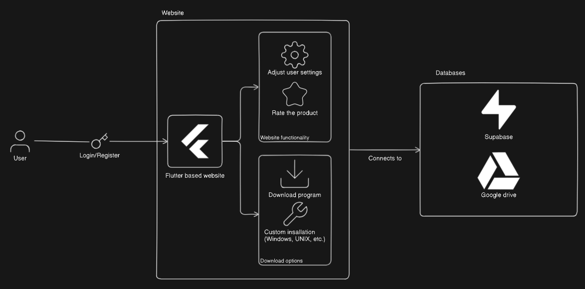
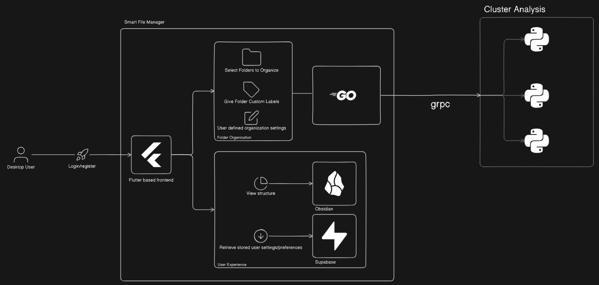

  

# Architectural Specifications

**Version:** 1.0.0.0  
**Prepared By:** Spark Industries  
**Prepared For:** Southern Cross Solutions  

## Content
* [Overview](#overview)
* [Architecture Style](#architecture-style)
* [System Components](#system-components)
    * [Website](#website)
    * [Application](#application)
* [Sub-architectural patterns](#sub-architectural-patterns)
* [Data storage](#data-storage)
* [Security](#security)
* [Scalability and Performance](#scalability-and-performance)
* [Deployment](#deployment)

## Overview

The smart file manager is designed with modular and scalable components for optimal performance and maintainability. This document outlines the architectural design, how components interact, and the system flow.

## Architecture Style

Smart file manager makes use of Client-Server architecture for the website. The application uses a Modular Monolithic structure and a Master-Slave between the API and AI.

1. Client server to allow users to communicate with the server and perform operations (downloading, profile edits etc.).
2. Monolithic structure such that the entire application is deployed as a single unit. Within the single unit, concerns are separated into independant layers.
3. The API (master) layer will communicate with, and manage the python threads (slaves).

## System Components
### Website
1. An easy to use interface for downloading the application.
2. Can be used to register an account.
### Application
1. Acts as file explorer.
2. Sort folders/files according to tags, metadata etc.
3. View structure graph.
4. Search for folders/files.
5. View and manage folders/files.

## Sub-Architectural Patterns
### Layered Architecure (N-tier)
1. Structures SFM into well-defined layers to separate concerns.
    1. Presentation
    2. Application
    3. Data 

### Event-Driven Architecture
1. 

## Data Storage

## Security

## Scalability and Performance

## Deployment
