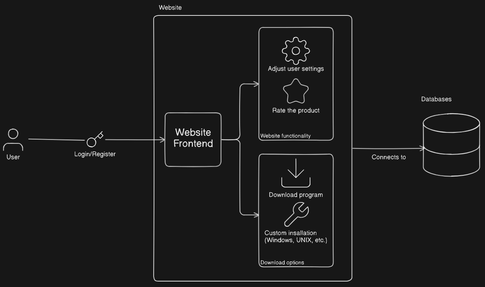

  

# System Requirements Specifications

**Version:** 1.0.0.0  
**Prepared By:** Spark Industries  
**Prepared For:** Southern Cross Solutions  

## Content
* [Introduction](#introduction)
* [User Stories / User Characteristics](#user-stories--user-characteristics)
* [Use Cases / Use Case Diagram](#use-cases--use-case-diagram)
* [Functional Requirements](#functional-requirements)
* [Service Contract](#service-contract)
* [Domain Model](#domain-model)
* [Architectural Requirements](#architectural-requirements)
    * [Quality Requirements](#quality-requirements)
    * [Architectural Patterns](#architectural-patterns)
    * [Design Patterns](#design-patterns)
    * [Constraints](#constraints)

## Introduction
The digital age seems to evolve at nearly the speed of light, yet somehow file managers are still learning to take their first steps. Cluttered desktops, folder mazes and the laborious hassle of organizing your files are not tasks the modern computer user should be plagued by.  

Meet Smart File Manager (SFM) your new digital housekeeper!  

SFM aims to take advantage of the power of metadata, natural language processing and AI clustering algorithms to automate file management.   
Whether you are an everyday general computer user, server administrator, tech-whizz or anything in between, SFM will automate your file management needs. 

Lay down some house rules - place filters, constraints and locks on your folders to help ensure SFM is doing its possible best job.  
Looking for that one file from 2 weeks ago that happened to be important all along - Ask SFM to do a smart context search using whatever semantic information you might still remember.  
Navigate your directories with an intuitive mind map exposing the underlying web connecting your files.  

SFM is not just another tool, it's your new digital housekeeper, your AI file finder and your new best friend.  

## User Stories / User Characteristics

## Use cases / Use Case Diagram
| Use Case                              | Actor | Abstract                                                                                                             | Preconditions                             | Postconditions                           |
| ------------------------------------- | ----- | -------------------------------------------------------------------------------------------------------------------- | ----------------------------------------- | ---------------------------------------- |
| UC1: Install Application              | User  | The user installs the SFM application on their device.                                                               | System requirements met.                  | Application is ready for configuration.  |
| UC2: Login                            | User  | The user logs in to save preferences across devices (optional).                                                      | User is registered.                       | Preferences are saved.                   |
| UC3: Configure Sorting Preferences    | User  | The user sets preferences for how often files are sorted and what rules to use (metadata, keywords, tags).           | Application is installed.                 | Configuration is saved.                  |
| UC4: Tag Files Manually               | User  | The user assigns custom tags to files.                                                                               | Application is installed.                 | Tags are stored and used for sorting.    |
| UC5: Auto-sort Files                  | SFM   | At scheduled intervals, the system automatically sorts files into directories based on metadata, keywords, and tags. | Files exist in monitored directories.     | Files are moved/sorted appropriately.    |
| UC6: View File Metadata               | User  | The user views detailed metadata of any file managed by SFM.                                                         | File exists and is indexed by the system. | Metadata displayed.                      |
| UC7: Visualize File Structure         | User  | The user views the current file organization as a graph.                                                             | File exists and is indexed by the system. | A graph-based UI is presented.           |
| UC8: Add/Remove Monitored Directories | User  | The user selects which directories the SFM should monitor.                                                           |                                           | The system updates its scan targets.     |
| UC9: Trigger Manual Sort              | User  | The user initiates file sorting manually.                                                                            | Application is installed.                 | Sorting process begins.                  |
| UC10: Lock Files/Folders              | User  | The user locks specific files or folders to prevent them from being sorted by SFM.                                   | Application is installed.                 | Locked items are skipped during sorting. |
| UC11: Search Files/Tags/Metadata      | User  | The user searches for files based on name, tags, or metadata.                                                        | Application is installed.                 | Search results are displayed.            |
| UC12: Keep Old Folder Structure       | User  | The user enables the option to preserve the original folder structure when sorting files.                            | Preferences configured.                   | Original folders are retained.           |
| UC13: Rollback Sorting Changes        | User  | The user rolls back the last sorting operation to restore previous file locations.                                   | Sorting has occurred at least once.       | Files returned to original locations.    |
| UC14: Auto-sort on File Download      | SFM   | When a new file or folder is downloaded, it is automatically sorted based on defined rules.                          | A new file or folder is downloaded.       | New content is sorted immediately.       |
| UC15: Register                        | User  | The user registers in order to login and save preferences                                                            | Application is installed.                 | User account is created.                 |

## Functional Requirements

1. Provide User Authentication.  
  1.1 Users must be able to register on the web portal if they wish.  
  1.2 Users must be able to download the application from the web portal.  
  1.3 Registered users must be able to log in to the downloaded application.  
  1.4 Users must be able to remain logged in to the application.  
  1.5 Logged in user must be able to log out of the application.  
  1.6 Registered user's preferences must be saved for to carry over to other platforms when logged in.  

2. File Metadata.  
  2.1 Users must be able to inspect file specific metadata associated with their files.  

3. Directory Organization.  
  3.1 Users must be able to create autonomously managed directories known as "smart folders".   
  3.2 Users must be able to choose a list of folders and files to be managed by smart folders.    
  3.3 Users must be able to let smart folders reorganize the contained files by semantic meaning (what logically relates the files).     
  &nbsp; 3.3.1 Smart folders must provide users with a preview of how the sorted file will look.  
  &nbsp; 3.3.2 Users must be able to accept or decline previewed reorganized file structure.  
  &nbsp; 3.3.3 Users should choose between copying accepted reorganized files or moving original files.    
  &nbsp; 3.3.4 Users should be able to lock files/folders they do not want to move or that should maintain relative position.    
  3.4 Users must be able to later add new files or folders to smart folder which should be auto-organized.  
  3.5 Users must be able to choose to add newly downloaded files directly to a smart folder for organization.  

4. File Searching.  
  4.1 Users must be able to search for files by name.  
  4.2 Users must be able to search for files by its semantic values (related files).  
  4.3 Users must be able to search for files by keywords.  
  4.4 Users must be able to search for files by supported metadata.  

5. Natural File Navigation.  
  5.1 Smart folders should be viewable as a graph / mind-map like strucutre.  
  5.2 Users must be able to navigate a smart manager via this mind-map structure.  
  5.3 Users must be able to see semantic connections between files in graph.  

6. Smart Manager Options and Customization.   
  6.1 Users must be able to set maximum number of subdirectories.  
  6.2 Users must be able to set maximum number of files in subdirectories.   
  6.3 Advanced users must have the option to tune the influence of different parameters on how files are organized.   
  6.4 Users must be able to configure how frequently smart folders are reorganized via a settings interface. 

7. File and folder tagging.  
7.1 Users must be able to create new tags for files and folders.  
7.2 Users must be able to apply tags to files and folders.  
7.3 Smart folders must also use tags to make organization decisions.  

8. Rollback.  
8.1 Users must be able to rollback to how folder structure looked before applying smart organization.  

## Service Contract

## Domain Model

## Architectural Requirements

### Quality Requirements
1. Performance.      
1.1 Time for reorganizing a new smart manager should scale linearly with amount of folders and files.  
1.2 Adding singular new file for organizing to a smart manager should not take longer than 30 seconds.     

2. Reliability.   
2.1 System AI should organize folders and files with high accuracy (> 90% as judged by user testing).   
2.2 Smart folders should remain accurate over prolonged usage and not become discoherent.  
2.3 Logical connection between files or folders inside a directory should be clear at first glance.    

3. Usability.  
3.1 Usage should be less cumbersome than traditional file mangers such as file explorer.  
3.2 Inexperienced users should not be overwhelmed by large number of options.  
3.3 Advanced users should be able to tailor smart management to their very particular needs.  

4. Portability.   
4.1 The system should run on any modern windows, linux or macOS machine.  

5. Security.   
5.1 The system should never permenantly store any information obtained from user files and all processing should happen locally.  
5.2 The system should ignore any files that requires administrative privilleges to modify.  
5.3 The system should only track and organize files that the user gave explicit permissions to organize.

### Architectural Patterns
.
1. Client server to allow users to communicate with the server and perform operations (downloading, profile edits etc.)

1. Monolithic structure such that the entire application is deployed as a single unit. Within the single unit, concerns are separated into independent layers.
2. The API (master) layer will communicate with, and manage the python threads (slaves).

### Design Patterns
The current design of our project makes use of 2 design patterns to achieve various functionality. Our decisions as to why these were used and how they are implemented follows:

**Composite**  
Used to represent the tree like structure associated with a directory structure. The classes that map to the participants are as follows:
* Component : ManagedItem
* Leaf: File
* Folder : Composite

The use of the composite pattern allows us to easily create, manage and traverse folder structures. A single instance of _ManagedItem_ may then be used by the _SmartFolder_ as an access point to an entire folder structure. By decoupling the folder structure from the _SmartFolder_ we may treat files and compositions of files (folders) uniformly. 

**Memento**  
Used to store the state of a _SmartFolder_ so it may be reinstated via a rollback at a later time. The classes that map to the participants are as follows:
* Originator : ManagedItem
* Memento : Memento
* Caretaker : SmartFolderBackup

Using the composite pattern an entire directory structure may be stored by creating a memento from the root of such a _ManagedItem_. This memento may then be stored in the _SmartFolderBackup_ for later rollback as initiated by the _SmartFolder_ upon request of the user.

### Constraints

