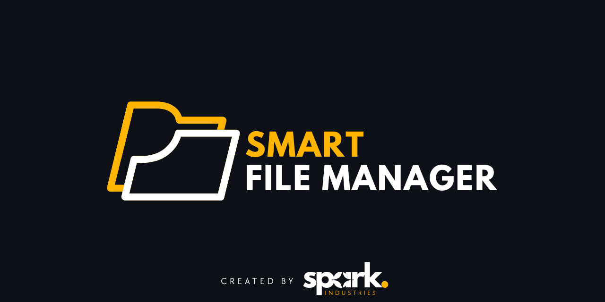

<!--
  README Template
  Replace all `<PLACEHOLDER>` with your own values.
-->

  

  In collaboration with Southern Cross Solutions

---

  <a href="https://YOUR_PROJECT_DEMO_URL">🌐 Live Demo</a> •
  <a href="#-features">Features</a> •
  <a href="#-getting-started">Getting Started</a> •
  <a href="#-roadmap">Roadmap</a> •
  <a href="#-contributing">Contributing</a> •
  <a href="#-license">License</a>

---

## 📄 Table of Contents

- [📑 Functional Requirements (SRS)](#-functional-requirements-srs)
- [📊 Project Board](#-project-board)

---

## 📑 Functional Requirements (SRS)

🔗 [Functional Requirements Document (SRS)](Documentation/srs.md)

---

## 📊 Project Board

🔗 [GitHub Project Board](https://github.com/COS301-SE-2025/Smart-File-Manager/projects?query=is%3Aopen)

---

| Photo                                                                           | Name & Role                                               | LinkedIn                                                                                                                                                                                                                          |
| ------------------------------------------------------------------------------- | --------------------------------------------------------- | --------------------------------------------------------------------------------------------------------------------------------------------------------------------------------------------------------------------------------- |
|                                                         | **Jack Bawden** Golang & Python                        |                                                      |
|  | **Philipp du Plessis** Golang & Python                 |  |
|   | **Tiaan Bosman** UX & UI Developer `Flutter & Dart` |                                          |
|  | **Henco Pretorius** Golang & Python           |                                                        |
|  | **Eve Müller** QA & Testing `Jest & Selenium`       |                                                  |

# Tooling and Automation
| Purpose            | Go                                   | Python                    |
| ------------------ | ------------------------------------ | ------------------------- |
| Formatting         | `go fmt` (enforced)                  | `ruff format` (fast)      |
| Linting            | `golangci-lint`                      | `ruff` + `mypy`           |
| Dependency updates | Renovate bot                         | Renovate bot              |
| Testing            | `go test` (with `-race`)             | `pytest`                  |
| Coverage           | Codecov Action                       | Codecov Action            |
| Docs               | tbd                                  | tbd                       |

# Requirements
	
  

  