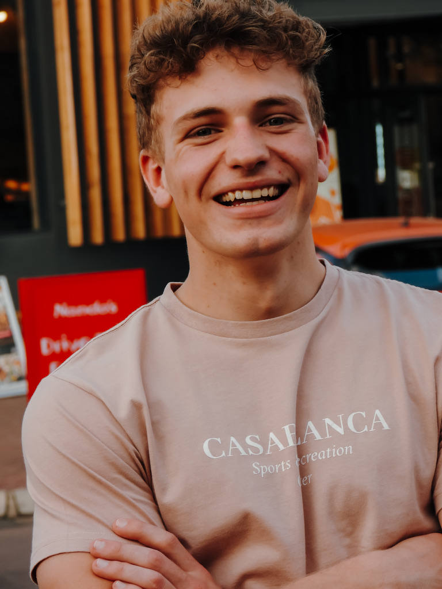

<!--
  README Template
  Replace all `<PLACEHOLDER>` with your own values.
-->

  

<h1 align="center">Spark Industries – <PROJECT_NAME></h1>

  **Spark Industries – <PROJECT_NAME> – <Short project description goes here>**  
   
  <a href="https://YOUR_PROJECT_DEMO_URL">🌐 Live Demo</a> •
  <a href="#-features">Features</a> •
  <a href="#-getting-started">Getting Started</a> •
  <a href="#-roadmap">Roadmap</a> •
  <a href="#-contributing">Contributing</a> •
  <a href="#-license">License</a>

---

## 📄 Table of Contents

- [📄 Table of Contents](#-table-of-contents)
- [📑 Functional Requirements (SRS)](#-functional-requirements-srs)
- [📊 Project Board](#-project-board)

---

## 📑 Functional Requirements (SRS)

🔗 [Functional Requirements Document (SRS)](`<SRS_LINK>`)

---

## 📊 Project Board

🔗 [GitHub Project Board](`<PROJECT_BOARD_LINK>`)

| Photo                      | Name & Role                                                   | LinkedIn                                                                                                                                                                          |
| -------------------------- | ------------------------------------------------------------- | --------------------------------------------------------------------------------------------------------------------------------------------------------------------------------- |
|    | **Jack Bawden** Golang & Python                            |                   |
| | **Philipp du Plessis** Golang & Python                     |      |
|   | **Tiaan Bosman** UX & UI Developer `Flutter & Dart` |          |
|     | **Dave Patel** DevOps Engineer `Docker & AWS`           |        |
|  | **Eve Müller** QA & Testing `Jest & Selenium`           |  |
