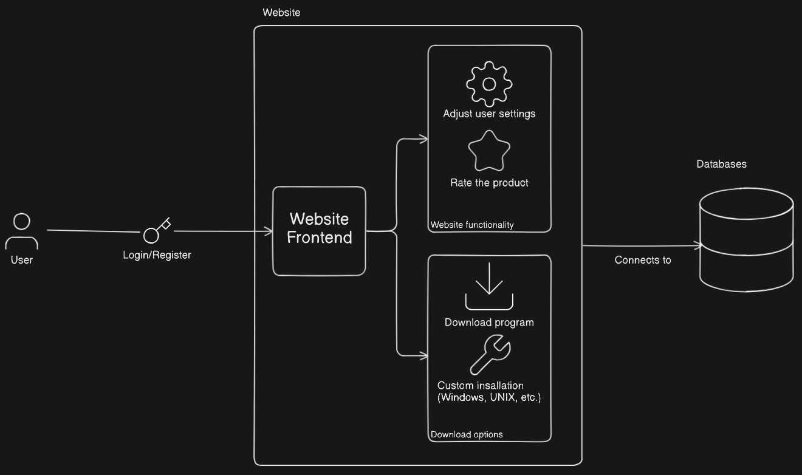
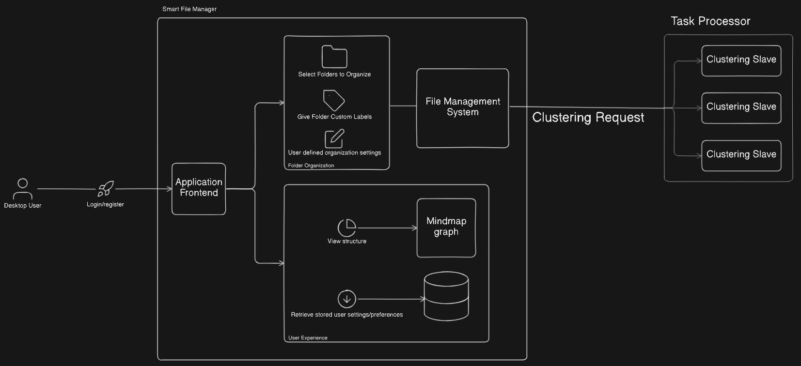

# Architectural Requirements Document

  

**Version:** 3.0.0.0  
**Prepared By:** Spark Industries  
**Prepared For:** Southern Cross Solutions  
**Document Type:** Architectural Requirements Document  
**Demo:** Demo 2

## Table of Contents

- [3.6.1 Architectural Design Strategy](#361-architectural-design-strategy)
- [3.6.3 Architectural Quality Requirements](#363-architectural-quality-requirements)
- [3.6.2 Architectural Strategies](#362-architectural-strategies)
- [3.6.4 Architectural Design and Pattern](#364-architectural-design-and-pattern)
- [3.6.5 Architectural Constraints](#365-architectural-constraints)
- [3.6.6 Technology Choices](#366-technology-choices)

---

## 3.6.1 Architectural Design Strategy

_This section will be completed for Demo 3._

The architectural design strategy selection and justification will be provided in the next demonstration phase.

---

## 3.6.3 Architectural Quality Requirements

The following quality requirements are prioritized from highest to lowest priority for the Smart File Manager system:

## Architectural Quality Requirements for Smart File Manager (SFM)

### 1. **Reliability**

- **Specification:** The system must maintain file integrity and recover gracefully from failures (e.g., crashes or power loss).
- **Testable Criteria:** No data corruption or loss during operations; system auto-recovers to last stable state after unexpected shutdowns.
- **Rationale:** Users must trust the system to manage personal or critical files safely and without risk of accidental loss.

### 2. **Performance**

- **Specification:** File operations, such as sorting, tagging, and smart search, must execute within acceptable time limits on standard desktop hardware.
- **Testable Criteria:** Smart search results must appear in under 2 seconds; bulk operations (e.g., tagging or reclassifying 500 files) must complete within 5 seconds.
- **Rationale:** Responsiveness is key to a smooth user experience in a personal desktop application. Delays can disrupt workflow and reduce trust in automation.

### 3. **Scalability**

- **Specification:** The system must handle increasing numbers of files, metadata, and tags without degradation in performance.
- **Testable Criteria:** Maintain acceptable performance (search in <2 seconds, classification in <5 seconds) when managing up to 1 million files or 1TB of data.
- **Rationale:** Personal file collections can grow substantially over time, so the system must remain efficient and responsive even at high volume.

### 4. **Usability**

- **Specification:** The user interface must be intuitive, accessible, and require minimal onboarding or training.
- **Testable Criteria:** First-time users can complete core tasks (e.g., find a file, create a smart manager, apply a tag) within 5 minutes, with no external documentation.
- **Rationale:** The system targets general users with varying technical skill levels; high usability promotes adoption and continued use.

### 5. **Modifiability**

- **Specification:** Users must be able to define or update rules, filters, and semantic tags without developer intervention.
- **Testable Criteria:** 100% of common modifications can be made through a graphical user interface without restarting the application.
- **Rationale:** Enables users to customize the system to suit their unique workflows and evolving organizational habits.

---

## 3.6.2 Architectural Strategies

<table>
  <thead>
    <tr>
      <th>Quality Attribute</th>
      <th>Architectural Strategy</th>
      <th>Implementation Details</th>
    </tr>
  </thead>
  <tbody>
    <tr>
      <td>Reliability</td>
      <td>Transactional File Operations</td>
      <td>All operations on the user files should either work completely for the entire operation or not modify the user's files at all.</td>
    </tr>
    <tr>
      <td>Performance</td>
      <td>Concurrency</td>
      <td>Leverage our master slave pattern to break slow requests into smaller operations which may be run concurrently. </td>
    </tr>
    <tr>
      <td>Performance</td>
      <td>I/O overhead</td>
      <td>Minimize the number of times files need to be opened to reduce I/O overhead. </td>
    <tr>
      <td>Scalability</td>
      <td>Horizontal Scaling</td>
      <td>Create more instances of Python slaves to increase throughput for high demand. </td>
    </tr>
    <tr>
      <td>Usability</td>
      <td>User-centered design</td>
      <td>Conduct usability tests, provide intuitive navigation, and minimize complexity. Provide accessible interfaces appropriate for users of varying skill level</td>
    </tr>
    <tr>
      <td>Modifiability</td>
      <td>Modular, loosely coupled architecture</td>
      <td>Design the system such that all operations accept various parameters while still having default ones. Allow users to customize these parameters from the user-interface.</td>
    </tr>
  </tbody>
</table>

---

## 3.6.4 Architectural Design and Pattern

_This section will be completed for Demo 3._

The detailed architectural design overview, system diagrams, and design decision justifications will be provided in Demo 3.

### Current Architecture Overview (From Demo 1)

**Architecture Style:** The Smart File Manager employs a hybrid architectural approach:

1. **Client-Server Architecture** for the website component

   - Enables users to communicate with the server for operations (downloading, profile management)

2. **Modular Monolithic Structure** for the application

   - Entire application deployed as single unit with separated concerns into independent layers

3. **Master-Slave Pattern** between Request Handler and Task Processor
   - Request Handler manages multiple Task Processor instances

### System Components

#### Website Component

- User-friendly interface for application download
- Account registration and management functionality

#### Application Component

- File explorer functionality
- File/folder sorting by tags and metadata
- Structure graph visualization
- Advanced search capabilities
- File and folder management operations

#### Sub-Architectural Patterns

- **Layered Architecture (N-tier):** Separates concerns into Presentation, Application, and Data layers

---

## 3.6.5 Architectural Constraints

The following constraints affect the architectural design of the Smart File Manager:

### Data Constraints

- File system access - Which components can access which directories or file types on the system
- Data persistance - Where can files be stored and naming conventions
- File format - restrictions on file types and accessing metadata.

### Technology Constraints

- Operating system compatibility - Must run on Windows, macOS, Linux platforms, thus need architecture that supports cross-platform.

### Performance Constraints

- runtime bottleneck - Slower execution affects real-time file operations.
- overhead in memory - higher memory usage for large file sorting operations.

### Deployment Constraints

- The system must be deployable as a desktop app
- Must run on Windows, Linux, and macOS with consistent functionality.

---

## 3.6.6 Technology Choices

This section provides an overview of the various technologies used in our stack and the reasoning behind each choice.

### Frontend Framework

#### Technology Options Assessed:

1. **Flutter**

   - **Overview:** Google's UI toolkit for building natively compiled applications
   - **Pros:** Cross-platform (Both Desktop and Mobile), Native performance, Material UI widgets
   - **Cons:** Larger binary size

2. **Electron**

   - **Overview:** Framework for building desktop applications using web technologies
   - **Pros:** Easy integration with web
   - **Cons:** Heavy memory usage, Does not directly support mobile (Needs Capacitor or Cordova)

3. **React Native**
   - **Overview:** Framework for building mobile applications using React
   - **Pros:** Cross-platform mobile/web
   - **Cons:** Weak desktop support

#### Final Choice: Flutter

**Justification:** Chosen for its ability to create cross-platform desktop applications with native performance, aligning with our architectural requirement for both desktop and mobile support while maintaining consistency across platforms.

---

### AI Capabilities

#### Technology Options Assessed:

1. **Python**

   - **Overview:** High-level programming language with extensive AI/ML libraries
   - **Pros:** Well supported for AI purposes (We use SciKit), Fast development
   - **Cons:** Slower runtime performance, Weak multithreading support

2. **Java**

   - **Overview:** Object-oriented programming language with strong ecosystem
   - **Pros:** High performance, Strong threading and ecosystem
   - **Cons:** Slower development speed for AI applications

3. **C++**
   - **Overview:** Low-level programming language with fine-grained control
   - **Pros:** High performance, Fine-grained control
   - **Cons:** Unreliable due to no memory safety

#### Final Choice: Python

**Justification:** Chosen for its out-of-the-box AI functionality and portability. The extensive library ecosystem (SciKit) provides rapid development capabilities essential for implementing intelligent file management features, despite performance trade-offs that are mitigated by our Go bridge component.

---

### Filesystem Management & Bridge

#### Technology Options Assessed:

1. **Go**

   - **Overview:** Compiled programming language designed for system programming
   - **Pros:** Easy concurrency with goroutines, Fast compilation, Simple learning curve
   - **Cons:** Less dynamic than scripting languages

2. **Rust**

   - **Overview:** Systems programming language focused on safety and performance
   - **Pros:** High performance, Memory Safety
   - **Cons:** Extreme learning curve

3. **Java**
   - **Overview:** Platform-independent programming language running on JVM
   - **Pros:** Portable due to JVM
   - **Cons:** Verbose and heavyweight for lightweight APIs

#### Final Choice: Go

**Justification:** Chosen for its powerful concurrency features to balance out Python's performance bottleneck and easy web development for endpoints required by the frontend. The goroutine-based concurrency model is ideal for handling multiple file operations simultaneously while maintaining system responsiveness.

---

### API Communication

#### Technology Options Assessed:

1. **gRPC**

   - **Overview:** High-performance RPC framework using Protocol Buffers
   - **Pros:** Very fast due to binary serialization, Code generation support, Strong typing
   - **Cons:** Requires more setup than REST

2. **REST**

   - **Overview:** Architectural style for distributed hypermedia systems
   - **Pros:** Simple and well-understood, Easy testing and debugging
   - **Cons:** No built-in type safety, Not ideal for dynamic recursive structures like Directories

3. **GraphQL**
   - **Overview:** Query language and runtime for APIs
   - **Pros:** Flexible queries, Efficient data fetching
   - **Cons:** Overkill for simple RPCs, More complex tooling

#### Final Choice: Hybrid Approach (gRPC + REST)

**Justification:**

- **gRPC:** Chosen for efficiency between Go and Python components due to binary serialization and strong typing, essential for high-performance file operations
- **REST:** Chosen for easy-to-use and testable endpoints between Go backend and Flutter frontend, providing simplicity for client-server communication

This hybrid approach leverages the strengths of both technologies where they are most appropriate within our multi-language architecture.

---
