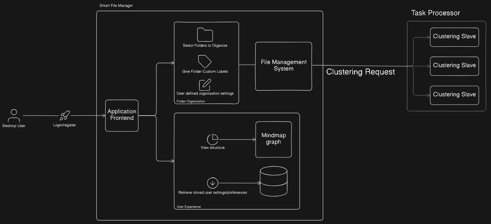

  

# System Requirements Specifications

**Version:** 3.0.0.0  
**Prepared By:** Spark Industries  
**Prepared For:** Southern Cross Solutions

## Content

- [Introduction](#introduction)
- [User Stories / User Characteristics](#user-stories--user-characteristics)
- [Use Cases / Use Case Diagram](#use-cases--use-case-diagram)
- [Functional Requirements](#functional-requirements)
- [Service Contract](#service-contract)
- [Domain Model](#domain-model)
- [Architectural Requirements](#architectural-requirements)
  - [Quality Requirements](#quality-requirements)
  - [Architectural Patterns](#architectural-patterns)
  - [Design Patterns](#design-patterns)
  - [Constraints](#constraints)
- [Technology Requirements](#technology-requirements)
- [Deployment Model](#deployment-model)

## Introduction

The digital age seems to evolve at nearly the speed of light, yet somehow file managers are still learning to take their first steps. Cluttered desktops, folder mazes and the laborious hassle of organizing your files are not tasks the modern computer user should be plagued by.

Meet Smart File Manager (SFM) your new digital housekeeper!

SFM aims to take advantage of the power of metadata, natural language processing and AI clustering algorithms to automate file management.  
Whether you are an everyday general computer user, server administrator, tech-whizz or anything in between, SFM will automate your file management needs.

Lay down some house rules - place filters, constraints and locks on your folders to help ensure SFM is doing its possible best job.  
Looking for that one file from 2 weeks ago that happened to be important all along - Ask SFM to do a smart context search using whatever semantic information you might still remember.  
Navigate your directories with an intuitive mind map exposing the underlying web connecting your files.

SFM is not just another tool, it's your new digital housekeeper, your AI file finder and your new best friend.

## User Stories / User Characteristics

### 1. User Story: Register on portal

**As a:** New user.  
**I want to:** Register for an account using either the web portal or after downloading the app.  
**So that I:** I can log in an sync all my preferences across multiple devices.

#### Acceptance criteria:

**Given** I am a new user.  
**When** I navigate to either the web portal registraton page or choose register on the application.  
**Then** My account is created and I should be notified that it took place successfully.  
**Covers:** UC15

### 2. User Story: Download the Application

**As a:** New or registered user.  
**I want to:** Download the SFM app on to my device.  
**So that I:** Can install the application.

#### Acceptance criteria:

**Given** I have access to the SFM portal.  
**When** I click the correct download button for my platform (Windows /macOS / linux).  
**Then** The application files are downloaded to my system.  
**Covers:** UC1

### 3. User Story: Log into the application

**As a:** Registered User.  
**I want to:** Log in on any device with the application installed.  
**So that I:** May have my preferences like themes and naming conventions apply on this device.

#### Acceptance criteria:

**Given** I am a registered user.  
**When** I enter my information and click log in.  
**Then** My details are authenticated and I am navigated to the application dashboard.  
**Covers:** UC2

### 4. User Story: Create a smart manager

**As a:** Registered User.  
**I want to:** Create a smart manager from a given folder root.  
**So that I:** Have all contained files automatically organized for me.

#### Acceptance criteria:

**Given** I have installed the application.  
**When** I click on create new smart manager.  
**Then** I am prompted for the root directory and a smart manager is created which sorts all the content by its semantic meaning.  
**Covers:** UC8

### 5. User Story: Configure sorting preferences

**As a:** User.  
**I want to:** Configure how and when smart folders are sorted.  
**So that I:** Have predictability and control over how and when my folders are sorted.

#### Acceptance criteria:

**Given** I have installed the application.  
**When** I open the settings and configure rules for sorting and sorting timers.  
**Then** My settings are saved and applied for future sorting.  
**Covers:** UC3

### 6. User Story: Tag files manually

**As a:** User  
**I want to:** Associate tags that I defined with certain files.  
**So that I:** May influence how the files are sorted and be used for sorting by tags.

#### Acceptance criteria:

**Given** The application is installed and a smart manager created.  
**When** I open the settings and configure rules for sorting and sorting timers.  
**Then** My settings are saved and applied for future sorting.  
**Covers:** UC4

### 7. User Story: Auto-sort files

**As a:** Smart Folder.  
**I want to:** Automatically sort folders and files at a regular interval.  
**So that I:** Keep directories organized without human intervention.

#### Acceptance criteria:

**Given** Files exist in a monitored directory and user preferences are set.  
**When** The timer for sorting expires.  
**Then** Files are moved to a more appropriate directory by the AI sorter.  
**Covers:** UC5

### 8. User Story: Graph File organization visualization

**As a:** User.  
**I want to:** See how my files are organized via an intuitive mind-map / graph view.  
**So that I:** May more naturally traverse through my files and interact with them.

#### Acceptance criteria:

**Given** I have created a smart manager which contains content.  
**When** I click on graph view.  
**Then** I see an interactive graph of my files and folders.  
**Covers:** UC7

### 9. User Story: Traditional File organization visualization

**As a:** User.  
**I want to:** See how my files are organized via traditional folder viewer.  
**So that I:** May traverse and interact with files in a well-know manner.

#### Acceptance criteria:

**Given** I have created a smart manager which contains content.  
**When** I click on folder view.  
**Then** I can traverse through the folder structure by clicking on folders.  
**Covers:** UC7

### 10. User Story: Trigger Manual Sort

**As a:** User.  
**I want to:** Manually initiate a file sorting process.  
**So that I:** May initiate a reorganize immediately.

#### Acceptance criteria:

**Given** The application is installed and settings configured.  
**When** I click on Sort Now on a smart mananger.  
**Then** The system initiates a reorganization of the smart manager.  
**Covers:** UC9

### 11. User Story: Lock files and folders

**As a:** User.  
**I want to:** Lock specific files and folders.  
**So that I:** Prevent them from being moved or sorted during organization.

#### Acceptance criteria:

**Given** I have a smart manager with content.  
**When** I select a file or folder and click the lock button.  
**Then** The item is excluded from future organization operations.  
**Covers:** UC10

### 12. User Story: View File metadata

**As a:** User.  
**I want to:** See metadata associated with a file.  
**So that I:** Can understand the content associated with my files.

#### Acceptance criteria:

**Given** I have a smart manager with content.  
**When** I select a file by clicking on it.  
**Then** A side-menu pops up showing me the metadata associated with that file.  
**Covers:** UC10

### 13. User Story: Search files, tags or metadata

**As a:** User.  
**I want to:** Search for files using names, tags or metadata.  
**So that I:** Can quickly find relevant content.

#### Acceptance criteria:

**Given** My files are sorted in a smart manager.  
**When** I enter a search query in the search bar.  
**Then** A list of files matching the criteria is returned.  
**Covers:** UC11

### 14. User Story: Rollback sorting changes

**As a:** User.  
**I want to:** Undo the last sorting operation.  
**So that I:** Restore my organization to what is was before the last sort.

#### Acceptance criteria:

**Given** I have performed a smart organization.  
**When** I Click on the rollback button for a smart manager.  
**Then** All files are returned to their exact previous location.  
**Covers:** UC11

### 15. User Story: Add a new file or folder.

**As a:** User.  
**I want to:** Create a new file or folder at some location in my smart manager.  
**So that I:** May interact with my filesystem via SFM to perform tasks I would with a regular filesystem.

#### Acceptance criteria:

**Given** I have a smart manager.  
**When** I click to create a new file or folder.  
**Then** The new item is added to the smart manager but not yet sorted.  
**Covers:** UC8

### 16. User Story: Stay logged in.

**As a:** User.  
**I want to:** Remained logged in after restarting the app.  
**So that I:** Don't have to log in every time I open the app.

#### Acceptance criteria:

**Given** I have logged in and did not log out.  
**When** I reopen the app.  
**Then** I am automatically still logged in.  
**Covers:** UC2

### 17. User Story: Customize smart sort behaviour.

**As an:** Advanced User.  
**I want to:** Set the influence of tags, metadata and other criteria on the sorting AI.  
**So that I:** Have fine control over the system.

#### Acceptance criteria:

**Given** Advanced customization options are set.  
**When** I adjust my customization options.  
**Then** The changes influence future sorting.

## Use cases / Use Case Diagram

| Use Case                              | Actor | Abstract                                                                                                             | Preconditions                             | Postconditions                           | Diagram                  |
| ------------------------------------- | ----- | -------------------------------------------------------------------------------------------------------------------- | ----------------------------------------- | ---------------------------------------- | ------------------------ |
| UC1: Install Application              | User  | The user installs the SFM application on their device.                                                               | System requirements met.                  | Application is ready for configuration.  |    |
| UC2: Login                            | User  | The user logs in to save preferences across devices (optional).                                                      | User is registered.                       | Preferences are saved.                   |    |
| UC3: Configure Sorting Preferences    | User  | The user sets preferences for how often files are sorted and what rules to use (metadata, keywords, tags).           | Application is installed.                 | Configuration is saved.                  |    |
| UC4: Tag Files Manually               | User  | The user assigns custom tags to files.                                                                               | Application is installed.                 | Tags are stored and used for sorting.    |    |
| UC5: Auto-sort Files                  | SFM   | At scheduled intervals, the system automatically sorts files into directories based on metadata, keywords, and tags. | Files exist in monitored directories.     | Files are moved/sorted appropriately.    |    |
| UC6: View File Metadata               | User  | The user views detailed metadata of any file managed by SFM.                                                         | File exists and is indexed by the system. | Metadata displayed.                      |    |
| UC7: Visualize File Structure         | User  | The user views the current file organization as a graph.                                                             | File exists and is indexed by the system. | A graph-based UI is presented.           |    |
| UC8: Add/Remove Monitored Directories | User  | The user selects which directories the SFM should monitor.                                                           |                                           | The system updates its scan targets.     |    |
| UC9: Trigger Manual Sort              | User  | The user initiates file sorting manually.                                                                            | Application is installed.                 | Sorting process begins.                  |    |
| UC10: Lock Files/Folders              | User  | The user locks specific files or folders to prevent them from being sorted by SFM.                                   | Application is installed.                 | Locked items are skipped during sorting. |  |
| UC11: Search Files/Tags/Metadata      | User  | The user searches for files based on name, tags, or metadata.                                                        | Application is installed.                 | Search results are displayed.            |  |
| UC12: Keep Old Folder Structure       | User  | The user enables the option to preserve the original folder structure when sorting files.                            | Preferences configured.                   | Original folders are retained.           |  |
| UC13: Rollback Sorting Changes        | User  | The user rolls back the last sorting operation to restore previous file locations.                                   | Sorting has occurred at least once.       | Files returned to original locations.    |  |
| UC14: Auto-sort on File Download      | SFM   | When a new file or folder is downloaded, it is automatically sorted based on defined rules.                          | A new file or folder is downloaded.       | New content is sorted immediately.       |  |
| UC15: Register                        | User  | The user registers in order to login and save preferences                                                            | Application is installed.                 | User account is created.                 |  |

## Functional Requirements

1. Provide User Authentication.  
   1.1 Users must be able to register on the web portal if they wish.  
   1.2 Users must be able to download the application from the web portal.  
   1.3 Registered users must be able to log in to the downloaded application.  
   1.4 Users must be able to remain logged in to the application.  
   1.5 Logged in user must be able to log out of the application.  
   1.6 Registered user's preferences must be saved for to carry over to other platforms when logged in.

2. File Metadata.  
   2.1 Users must be able to inspect file specific metadata by clicking on a file.  
   2.2 Users must be able to view a base set of metadata for all files and an extended set for specific file types.

3. Directory Organization.  
   3.1 Users must be able to create autonomously managed directories known as "smart folders".  
   3.2 Users must be able to choose a list of folders and files to be managed by smart folders.  
   3.3 Users must be able to let smart folders reorganize the contained files by semantic meaning (what logically relates the files).  
   &nbsp; 3.3.1 Smart folders must provide users with a preview of how the sorted file will look.  
   &nbsp; 3.3.2 Users must be able to accept or decline previewed reorganized file structure.  
   &nbsp; 3.3.3 Users should choose between copying accepted reorganized files or moving original files.  
   &nbsp; 3.3.4 Users should be able to lock files/folders they do not want to move or that should maintain relative position.  
   3.4 Users must be able to later add new files or folders to smart folder which should be auto-organized.  
   3.5 Users must be able to choose to add newly downloaded files directly to a smart folder for organization.

4. File Searching.  
   4.1 Users must be able to search for files by name.  
   4.2 Users must be able to search for files by its semantic values (related files).  
   4.3 Users must be able to search for files by keywords.  
   4.4 Users must be able to search for files by supported metadata.

5. Natural File Navigation.  
   5.1 Smart folders should be viewable as a graph / mind-map like strucutre.  
   5.2 Users must be able to navigate a smart manager via this mind-map structure.  
   5.3 Users must be able to see semantic connections between files in graph.

6. Smart Manager Options and Customization.  
   6.1 Users must be able to set maximum number of subdirectories.  
   6.2 Users must be able to set maximum number of files in subdirectories.  
   6.3 Advanced users must have the option to tune the influence of different parameters on how files are organized.  
   6.4 Users must be able to configure how frequently smart folders are reorganized via a settings interface.

7. File and folder tagging.  
   7.1 Users must be able to create new tags for files and folders.  
   7.2 Users must be able to apply tags to files and folders.  
   7.3 Smart folders must also use tags to make organization decisions.

8. Rollback.  
   8.1 Users must be able to rollback to how folder structure looked before applying smart organization.

## Service Contract

## Domain Model

## Architectural Requirements

**IMPORTANT:** This sections only provides a brief overview of our architecture. Kindly consult [here](Architecture.md) for the detailed documentation on architecture.

### Quality Requirements

1. Performance.  
   1.1 Time for reorganizing a new smart manager should scale linearly with amount of folders and files.  
   1.2 Adding singular new file for organizing to a smart manager should not take longer than 30 seconds.

2. Reliability.  
   2.1 System AI should organize folders and files with high accuracy (> 90% as judged by user testing).  
   2.2 Smart folders should remain accurate over prolonged usage and not become discoherent.  
   2.3 Logical connection between files or folders inside a directory should be clear at first glance.

3. Usability.  
   3.1 Usage should be less cumbersome than traditional file mangers such as file explorer.  
   3.2 Inexperienced users should not be overwhelmed by large number of options.  
   3.3 Advanced users should be able to tailor smart management to their very particular needs.

4. Portability.  
   4.1 The system should run on any modern windows, linux or macOS machine via.  
   4.2 The system must be packaged as a singular downloadble application that may be installed on any of the above mentioned platforms.

5. Security.  
   5.1 The system should never permenantly store any information obtained from user files and all processing should happen locally.  
   5.2 The system should ignore any files that requires administrative privilleges to modify.  
   5.3 The system should only track and organize files that the user gave explicit permissions to organize.

### Architectural Patterns
#### Application Architecture

Hybrid between Monolithic and Master-Slave  
Monolithic structure such that the entire application is deployed as a single unit, which is ideal as our application will be deployed entirely on the user's local machine.
The clustering request uses gRPC to communicate from Go to Python. A master slave pattern is applied in our python codebase. A master monitors incoming requests from gRPC and scales the service via python threads (slaves) that perform the AI requirements such as clustering and other tasks such as metadata extraction.

#### Hybrid Approach Benefits

Combining both Go and Python allows us to leverage the strenghts of each for the best product possible. Go is coveted for its safety and strong concurrency while Python is the de facto standard for any AI related tasks. Combining these allows us to provide an implementation that is both accurate while remaining highly efficient.

### Design Patterns

The current design of our project makes use of 2 design patterns to achieve various functionality. Our decisions as to why these were used and how they are implemented follows:

**Composite**  
Used to represent the tree like structure associated with a directory structure. The classes that map to the participants are as follows:

- Component : ManagedItem
- Leaf: File
- Folder : Composite

The use of the composite pattern allows us to easily create, manage and traverse folder structures. A single instance of _ManagedItem_ may then be used by the _SmartFolder_ as an access point to an entire folder structure. By decoupling the folder structure from the _SmartFolder_ we may treat files and compositions of files (folders) uniformly.

**Memento**  
Used to store the state of a _SmartFolder_ so it may be reinstated via a rollback at a later time. The classes that map to the participants are as follows:

- Originator : ManagedItem
- Memento : Memento
- Caretaker : SmartFolderBackup

Using the composite pattern an entire directory structure may be stored by creating a memento from the root of such a _ManagedItem_. This memento may then be stored in the _SmartFolderBackup_ for later rollback as initiated by the _SmartFolder_ upon request of the user.

### Constraints

The following constraints has been highlighted by our team:

- SFM will not manage any system-level files that would require administrative privileges to move, change, or otherwise manage.
- SFM will not provide access to any shared user directories as it only manages local machine files.
- SFM will not integrate directly with existing cloud storage services such as Microsoft One-Drive or Dropbox.

## Technology Requirements

This sections acts as a brief overview of the various technologies used in our stack and why they were chosen.

<table border="1" cellspacing="0" cellpadding="8">
  <thead>
    <tr>
      <th>Technology</th>
      <th>Options</th>
      <th>Benefits</th>
      <th>Drawbacks</th>
      <th>Final Choice Reasoning</th>
    </tr>
  </thead>
  <tbody>
    <tr>
      <td rowspan="4"><strong>Frontend Framework</strong></td>
      <td><strong>Flutter</strong></td>
      <td>
        Cross-platform (Both Desktop and Mobile) 
        Native performance 
        Material UI widgets
      </td>
      <td>
        Larger binary size 
      </td>
      <td><strong>Chosen</strong> For its ability to create cross platform desktop apps. </td>
    </tr>
    <tr>
      <td>Electron</td>
      <td>
        Easy integration with web 
      </td>
      <td>
        Heavy memory usage 
        Does not directly support mobile (Needs Capacitor or Cordova)
      </td>
      <td></td>
    </tr>
    <tr>
      <td>React Native</td>
      <td>
        Cross-platform mobile/web 
      </td>
      <td>
        Weak desktop support 
      </td>
      <td></td>
    </tr>
    <tr>
    </tr>
    <tr>
      <td rowspan="4"><strong>AI Capabilities</strong></td>
      <td><strong>Python</strong></td>
      <td>
        Well supported for AI purposes (We use SciKit)  
        Fast development
      </td>
      <td>
        Slower runtime performance 
        Weak multithreading support
      </td>
      <td><strong>Chosen</strong> For its out of the box AI functionality and portability</td>
    </tr>
    <tr>
      <td>Java</td>
      <td>
        High performance 
        Strong threading and ecosystem
      </td>
      <td>
        Slower dev speed for AI
      </td>
      <td></td>
    </tr>
    <tr>
    </tr>
    <tr>
      <td>C++</td>
      <td>
        High performance 
        Fine-grained control
      </td>
      <td>
        Unreliable due to no memory safety  
      </td>
      <td></td>
    </tr>
    <tr>
      <td rowspan="4"><strong>Filesystem management & Bridge</strong></td>
      <td><strong>Go</strong></td>
      <td>
        Easy concurrency with goroutines 
        Fast compilation 
        Simple learning curve 
      </td>
      <td>
        Less dynamic than scripting languages 
      </td>
      <td><strong>Chosen</strong> For powerful concurrency features to balance out python bottleneck & Easy web development for endpoints required by frontend </td>
    </tr>
    <tr>
      <td>Rust</td>
      <td>
        High performance 
        Memory Safety 
      </td>
      <td>
        Extreme learning curve 
      </td>
      <td></td>
    </tr>
    <tr>
    </tr>
    <tr>
      <td>Java</td>
      <td>
        Portable due to JVM
      </td>
      <td>
        Verbose and heavyweight for lightweight APIs
      </td>
      <td></td>
    </tr>
    <tr>
      <td rowspan="4"><strong>API</strong></td>
      <td><strong>gRPC</strong></td>
      <td>
        Very fast due to binary serialization 
        Code generation support 
        Strong typing
      </td>
      <td>
        Requires more setup than REST
      </td>
      <td><strong>Chosen</strong> For efficiency between Go and Python. See grpc.md</td>
    </tr>
    <tr>
      <td><strong>REST</strong></td>
      <td>
        Simple and well-understood 
        Easy testing and debugging
      </td>
      <td>
        No built-in type safety  
        Not ideal for dynamic recursive structures like Directories
      </td>
      <td><strong>Chosen</strong> For easy to use and test endpoints between Go and Frontend</td>
    </tr>
    <tr>
      <td>GraphQL</td>
      <td>
        Flexible queries 
        Efficient data fetching
      </td>
      <td>
        Overkill for simple RPCs 
        More complex tooling
      </td>
      <td></td>
    </tr>
    <tr>
    </tr>
  </tbody>
</table>

## Deployment Model
Our application will be deployed as an executable desktop app for various operating systems. While we currently have support for Microsoft Windows and GNU Linux we hope to support deployment for MacOS in the future.

### Justification for Deployment model
Our project's nature requires it to run on the user's machine. Its close dependancy on the filesystem makes it unsuitable for a web-based application which would need to be deployed on a server. Furthermore, by doing all processing on the local machine we avoid the obvious security and privacy risk involved in sending user files (which could contain sensitive information) over a network for processing or (even worse) storing these files on a server.
At this point it would be important to make the distinction that our project **never** stores any file information permenantly in any other location than the user's filesystem.

To ease the complicated build process on behalf of users we aims to provide exceutables for the various commonly used operating systems by means of an installer.

### How to access our deployments
Our installers can be found on and downloaded via the google drive link provided on our readme.

### Deployment Diagram
