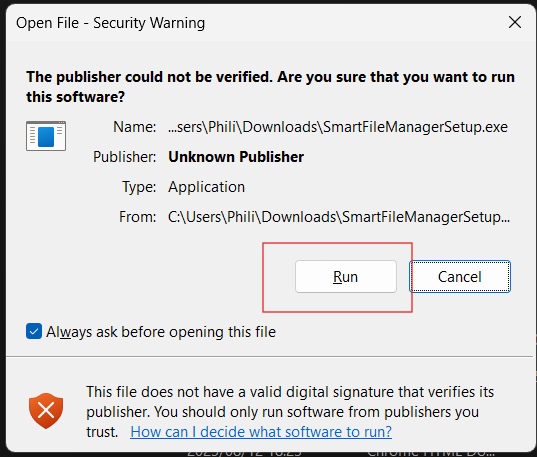
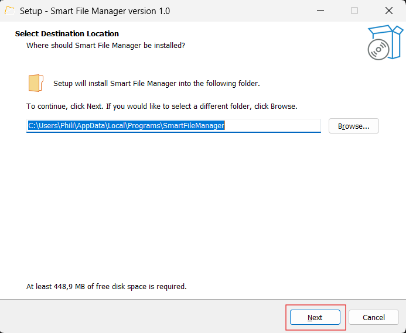
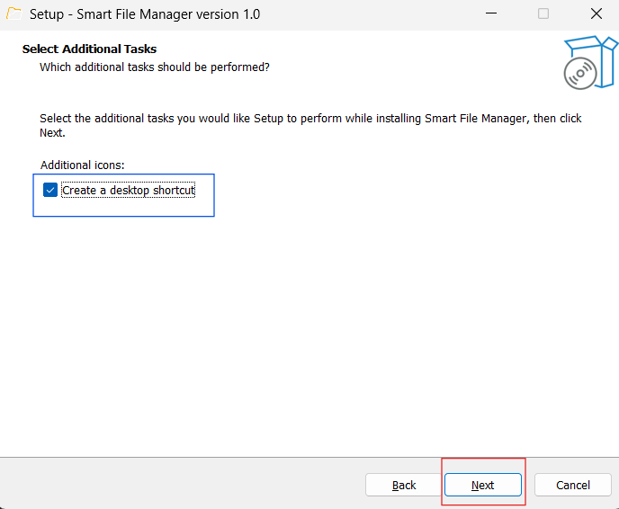
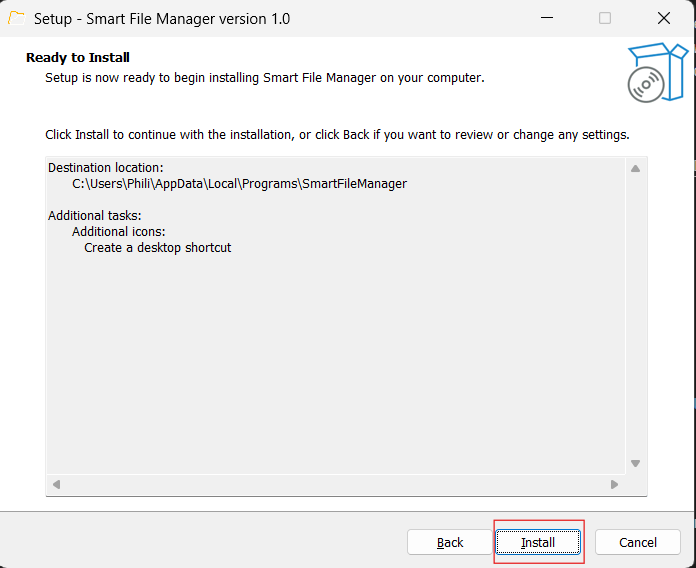
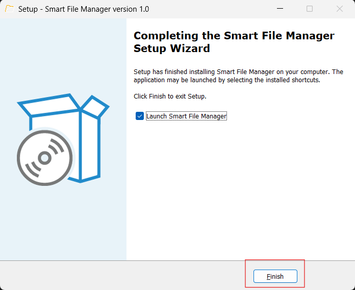

  

# Technical Installation Document for SparkIndustries

**Version:** 1.0.0.0  
**Prepared By:** Spark Industries  
**Prepared For:** Personal Development team use  

## Content
* [Introduction](#introduction)
* [Installer](#installer)
* [Building from Scratch](#building-the-project-from-scratch)

## Introduction
The following document serves as the technical installation document for SparkIndustries. It provides detailed instructions for how to download and install the program using the following approaches:
1. Using the provided downloadable installer (The recommend approach)
2. Building the project from scratch via cloning the repository.
3. Creating your own installer (Not recommended but provided for completeness)

**A Note of supported platforms:**
Our application is designed with the intention to be useable on Microsoft Windows, Linux and MacOS. For the purpose of this demo we only provide an installer for Windows, however in the future we will be releasing an installer for Linux distibutions as well (Tested on Linux Mint). The requirement of an apple developer's lisence prevents us from deploying to MacOS. However Mac Users may still build the project from scratch using the instructions provided in this document. 

## Installer

This section details where to download the installer and how to use it to install Smart File Manager to your device. Please note that the Windows operating system might (and likely will) flag the application as high risk and administrator privileges may be required to allow the install. While SparkIndustries is not aware of any risk that the application might pose, we do not take any liability for issues or harm caused to a system by installing the program. User discresion is advised.

### Step 1: Downloading the installer
The installer may be downloaded from our google drive [here](https://drive.google.com/drive/folders/1KlQ3yYhmHYFbv0vVpLBJv5CjVyD5idO4) (approximately 500MB)

### Step 2: Running the installer
Execute the installer by double clicking on it. At this point you might be flagged by the security system as follows. Click the __run__ button as indicated to proceed.

Next you will be prompted to select the install destination. Choose this path as desired or use the default install location __Users/AppData/Local/Programs/SmartFileManager__ and click on __next__ to proceed.

You will now be prompted with a screen prompting you with additional tasks. On this page you may choose to create a desktop shortcut using the provided checkbox (higlighted in blue). After selecting your choice proceed by clicking on __next__.

Finally, confirm the installation by clicking on the __install__ button as highlighted.

The app will now install. After installation you will be shown the following screen from where you may choose to launch the app. Click on __finish__ to complete the process.

You have now successfully installed Smart File Manager!

## Building the project from scratch

