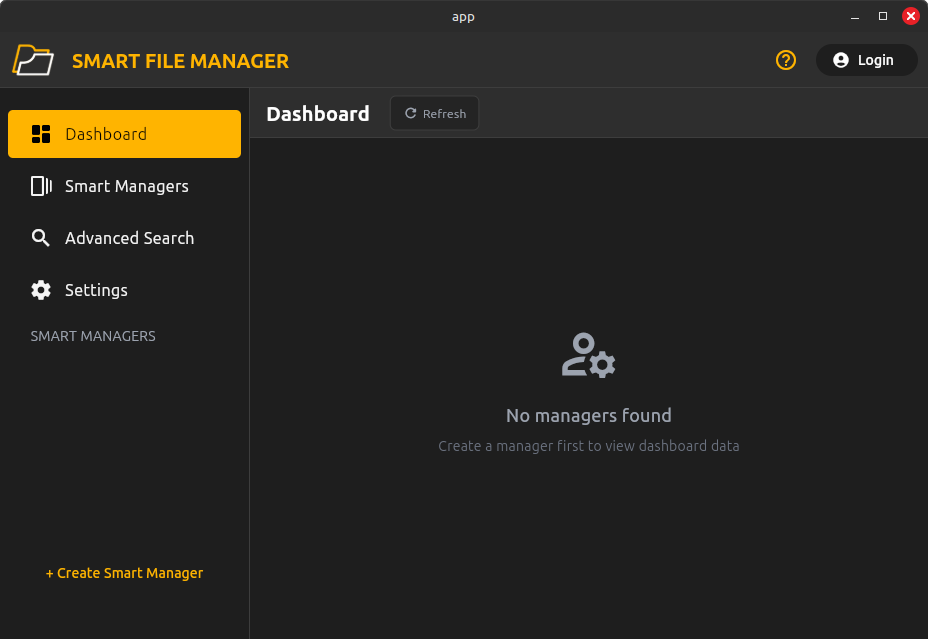
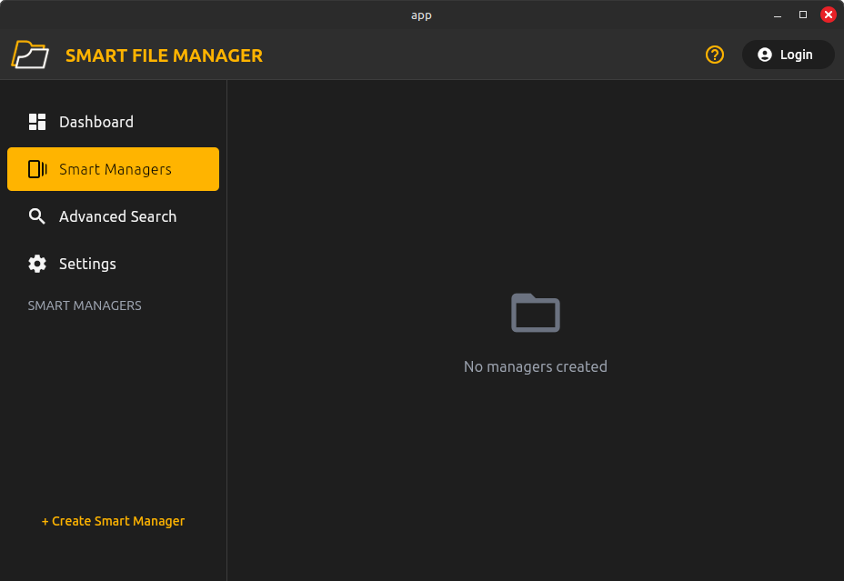
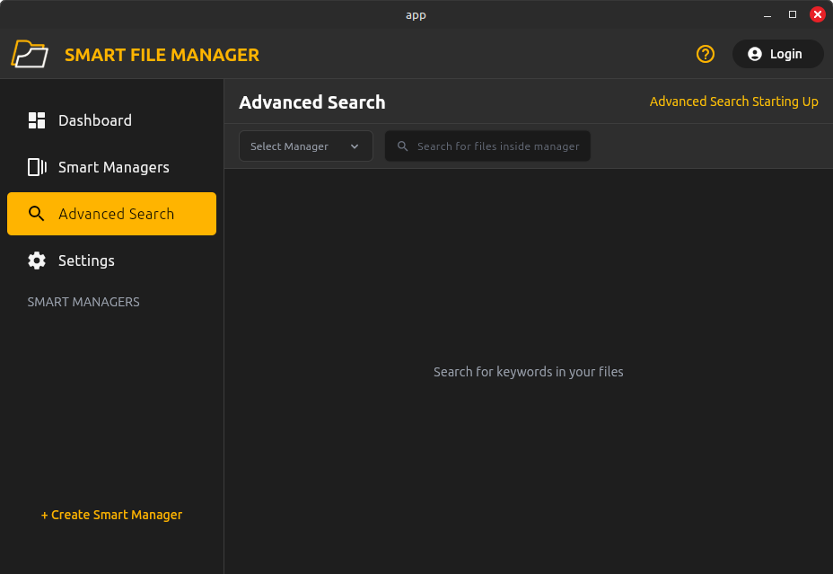
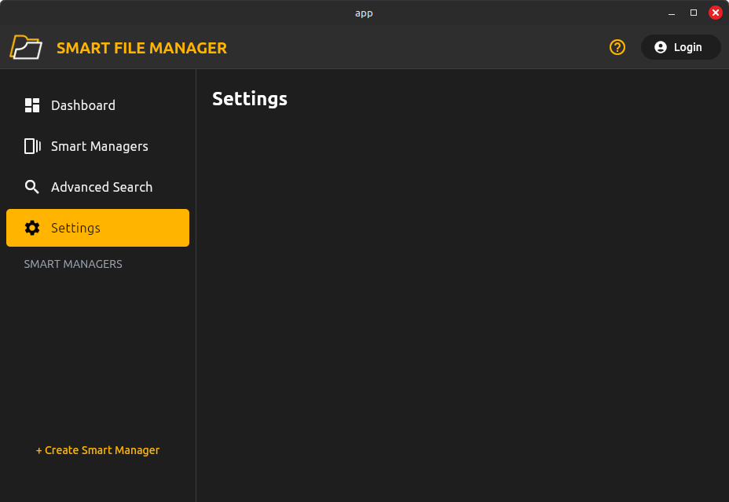
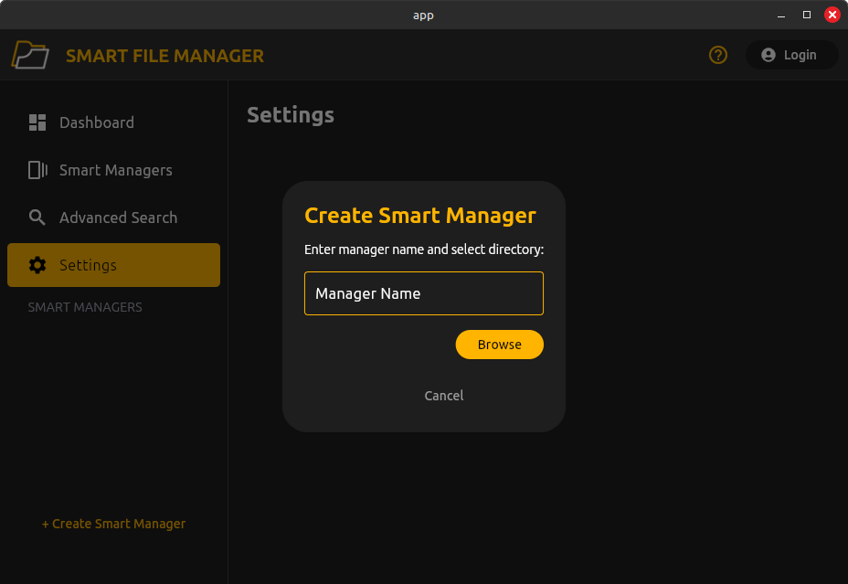
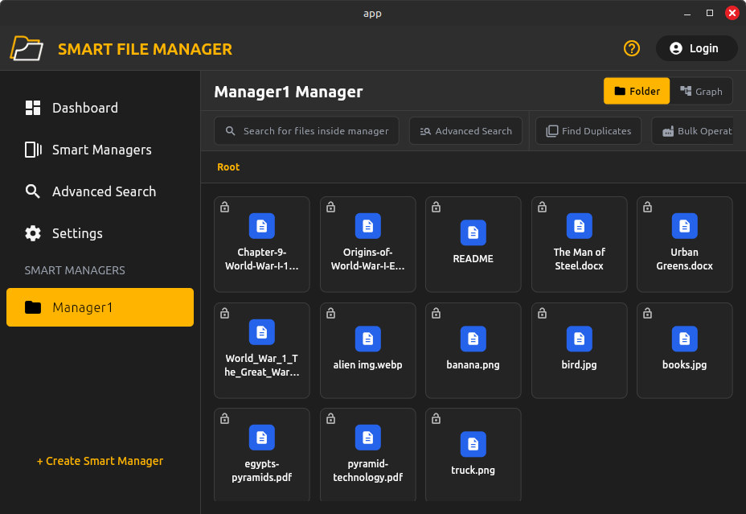
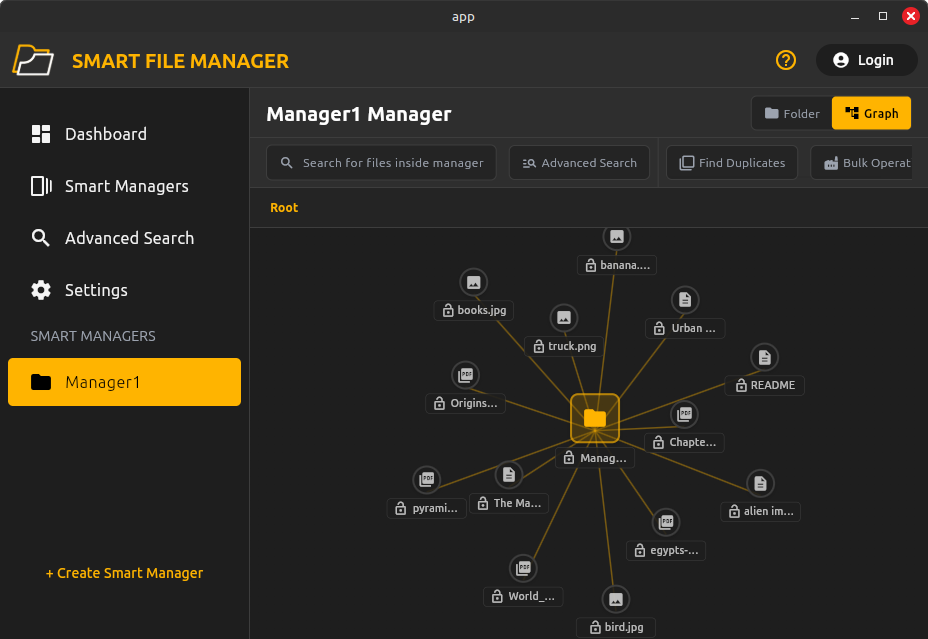
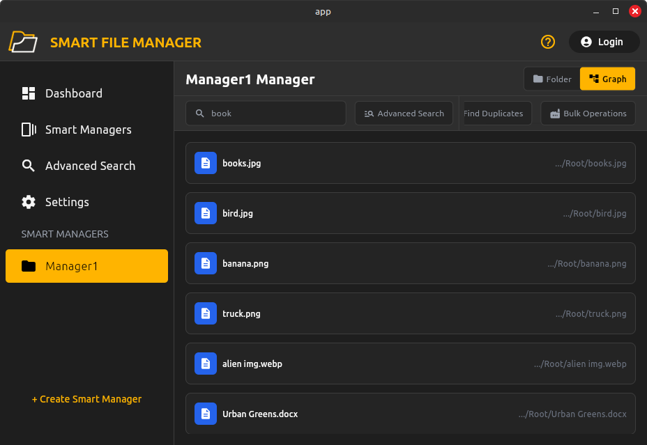
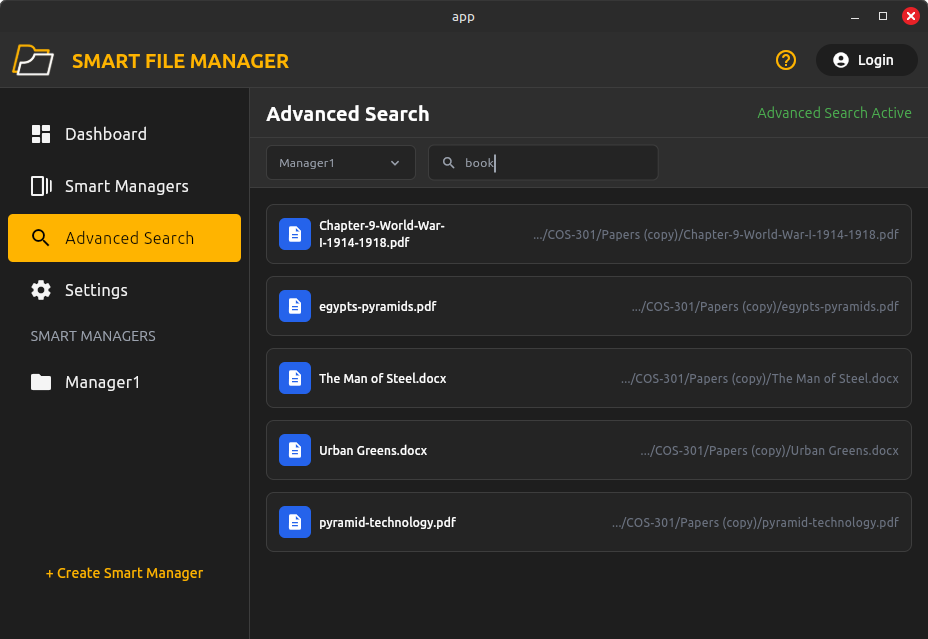

  

# User Manual  

**Version:** 1.0.0.0  
**Prepared By:** Spark Industries  
**Prepared For:** All our Users 

## Content
* [Introduction](#introduction)
* [Startup Page](#start-up-page)
* [Creating A Smart Manager](#creating-a-smart-manager)
* [Graph View](#graph-view)
* [Search](#search)
* [Advanced Search](#advanced-search)
* [Glossary](#glossary)

## Introduction
This document aims to server as a detailed manual of how to use smart file manager. It goes into detail on how to use the various features by simulating the flow of how the average user would likely interact with the system. It is broken up into sections corresponding to different features. If any term is unclear please consult the glossary linked [here](#glossary). We recommend reading this document sequentially for the best overview of how to use the system effectively.

**Note:** Please ensure that SFM has been installed on your system. Detailed instructions for doing so may be found [here](technical_installation.md)

## Start Up Page
When starting SFM for the first time you will be shown the following page

  

Currently there are no managers created so the dashboard page shows no statistics. From the sidebar we can see the various pages available to the user. These include:

1. Dashboard (currently selected)
2. Smart Managers 
3. Advanced Search
4. Settings

We'll now show each page as it appears without any smart managers created (note: dashboard already shown)

### Smart Manager

  

### Advanced Search 

  

### Settings 

  

## Creating a Smart Manager

To create a new smart manager to manage a subset of files follow these steps.

Click on the **+Create Smart Manager** button in the bottom-left corner of any page. The following pop-up will appear.

  

Enter the name of the manager and select the root of the new manager by using the **browse** button. Click **create** to confirm and make a new manager

  

After creating a manager the following screen will appear.

  

All of the your created managers will appear on the sidebar. Clicking on the manager in the sidebar will provide you with the page shown above. From here all files inside a manager may be viewed. The other features on this page will be explained in the sections to follow.

## Graph View
Once a manager has been created the files may be viewed in the traditional file structure. However, SFM offers a state of the art graph based view of your files which allows you to better understand the organization of your files.
 
Having selected a smart manager on the sidebar swap over from Folder view to Graph view using the button in the top-right corner of the screen. You will be presented with a view appearing as follows:

  

## Search
For any created manager SFM allows you to search for any file at breakneck speed. To access this feature select the smart manager you wish to search in using the sidebar. Underneath the manager name there is a textbox captioned **search for files inside manager**. Type your desired filename in here to search for it. SFM make use of a [fuzzy search](#glossary), hence even if an exact result cannot be found a close match will be presented. The search results are returned as shown below.

  

As can be seen from the example searching for "books" returned the exact match, followed by close results (words starting in "b").

## Advanced Search
SFM also provides an advanced search which considers keywords extracted from text-based files. To acces this feature select Advanced Search in the sidebar. In the top right corner wait for the page to display **Advanced Search Active**. Using the left dropdown select the name of the manager that you want to perform the advance search on. Using the right input, enter the search text which will be compared to the file's keywords. Note that advanced search still makes use of a [fuzzy search](#glossary). After performing an advanced search the output will display similar to below.

  

Note the difference in the files returned for the same search text. Here the a file on world-war-1 was returned since the search text was compared to keywords and the document contains terms such as  "textbook", "workbook" etc...

## Glossary
In this section we describe some terms that we use in the user manual.

### Smart Manager
A smart manager is the principle object of smart file manager. It can be thinked of as a repo which manages all files it has been set to track. When creating a smart manager you may select the root. All content contained in this root will be tracked by the smart manager and any operations that you wish to perform will act on the files inside this manager.

### Graph View
A graph or mindmap based view of a smart directory showing files and folders as nodes with the connections between them as edges.

### Fuzzy Search
A type of search where exact results and close results are returned when searching for something. For example: Searching for the term "Banking Details" may also retunr "Banking", "Bank Details" or even "Membership Details" etc... Note that "closest" results will always be returned first.

