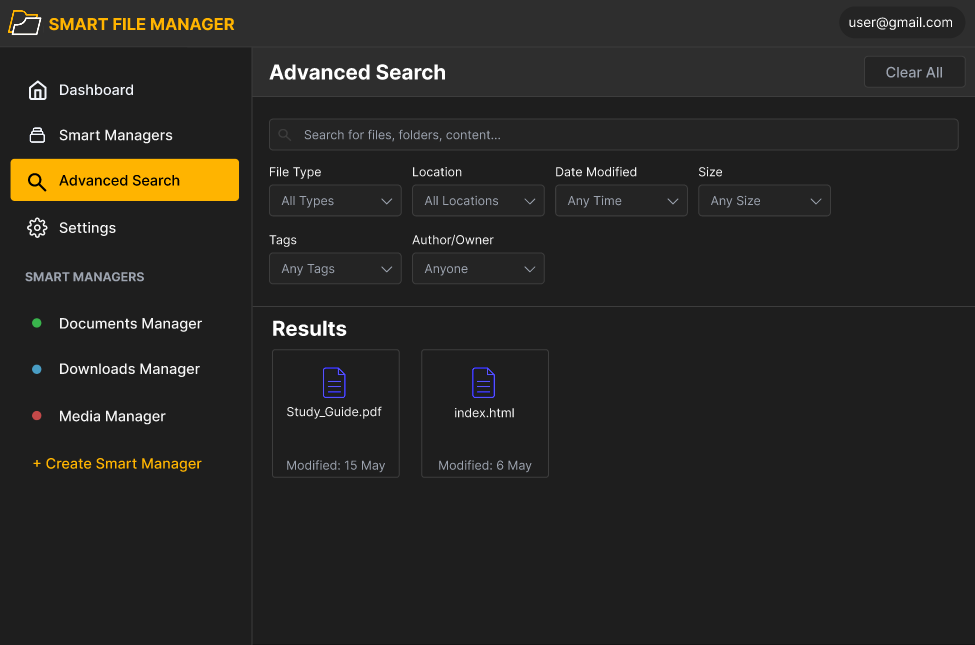

# Smart File Manager - User Manual

Version 2.0.0

## Table of Contents

1. [Introduction](#introduction)
2. [Getting Started](#getting-started)
3. [Dashboard Overview](#dashboard-overview)
4. [Smart Managers](#smart-managers)
5. [Managing Your Files](#managing-your-files)
6. [Advanced Search](#advanced-search)
7. [Settings](#settings)
8. [Tips and Best Practices](#tips-and-best-practices)
9. [Troubleshooting](#troubleshooting)

---

## Introduction

Welcome to Smart File Manager (SFM), an file organization system that helps you keep your files organized automatically. Think of it as having a personal assistant that knows exactly where to put your files and how to find them when you need them.

### What is Smart File Manager?

Smart File Manager uses "Smart Managers" - organizing systems that automatically sort and categorize your files based on rules you set. Instead of manually organizing thousands of files, you create Smart Managers that do the work for you.

### Key Features

- **Automatic file organization** with Smart Managers
- **Visual file relationships** with graph view
- **Powerful search capabilities** across all your files
- **Real-time statistics** and organization tracking
- **Flexible tagging system** for better file discovery

---

## Getting Started

### Main Navigation

The left sidebar is your main navigation hub. Here's what each section does:

- **Dashboard** - Your home base with file statistics and quick access
- **Smart Managers** - View and edit your Smart Manager preferences
- **Advanced Search** - Find files using powerful search filters
- **Settings** - Customize your Smart File Manager experience
- **Indivdual Smart Managers** - Treverse, folder structure, open files, add tags and use graph view!

---

## Dashboard Overview

Your dashboard gives you a overview of your file organization:

### Statistics at a Glance

- **Total Files**: See how many files Smart File Manager is tracking
- **Storage Used**: Monitor your storage consumption (2.34 GB shown)
- **Organization Level**: Track how well-organized your files are (72% organized)
- **Smart Managers**: Count of active organizing systems (3 managers)

### Quick Access Section

This area shows your most frequently accessed files. Click any file to open it instantly!

---

## Smart Managers

Smart Managers are the heart of your file organization system. Think of each Smart Manager as a specialized filing assistant.

### Understanding Smart Managers

Each Smart Manager:

- **Organizes a specific user defined folder structure**
- **Shows its organization status**
- **Manages files across multiple directories**
- **Has the ability to sort its folder structure**

### Creating a New Smart Manager

1. Click the **"Create"** button in the bottom side of the navigation bar
2. Choose the name and folder this manager will manage
3. Set your organization preferences (can be found on the managers page):
   - **Max files per directory**: How many files before creating a new folder (default: 200)
   - **Max directory depth**: How many folder levels deep to organize (default: 20)

### Managing Existing Smart Managers

For each Smart Manager, you can:

- **Sort**: Reorganize files within the manager
- **Rename**: Change the manager's name
- **Delete**: Remove the manager (files remain, but organization stops)
- **Save**: Apply any changes you've made

---

## Managing Your Files

### Folder View

The traditional folder view shows your files in a familiar format:

#### File Information Panel

When you select a file (like "notes.docx" in the example), you'll see:

- **File type and size** (Word Document, 2.8 MB)
- **Creation and modification dates**
- **Tags** for easy categorization

#### Available Actions

- **Open File**: Launch the file in its default application
- **Add Tags**: Categorize files with custom labels
- **Delete Tags**: Categorize files with custom labels
- **Lock File**: Prevent accidental changes or deletion
- **Delete File**: Remove the file permanently

#### Search and Filter Tools

- **Search within manager**: Find specific files quickly
- **Sort by**: Organize by name, date, size, or type
- **Filter**: Show only certain file types

### Graph View

The force directed graph view shows how your files relate to each other:

#### Understanding the Graph

- **Central yellow node**: Main folder or primary file
- **Connected colored nodes**: Related files and subfolders
- **Lines between nodes**: Show relationships and connections
- **Node colors**: Different colors represent different file depths

#### When to Use Graph View

- **Exploring project relationships**: See how files in a project connect
- **Finding related documents**: Discover files you might have forgotten
- **Understanding file structure**: Visualize complex folder hierarchies

---

## Advanced Search

When you need to find specific files across your entire system, Advanced Search is your best friend.

### Search Filters

**File Type**: Choose from documents, images, videos, or any specific format
**Location**: Search in specific folders or across all locations
**Date Modified**: Find files changed within specific time periods
**Size**: Locate files within certain size ranges
**Tags**: Search by the tags you've assigned
**Author/Owner**: Find files created by specific people

### Using Advanced Search Effectively

1. **Start broad, then narrow**: Begin with general criteria, then add specific filters
2. **Use multiple filters**: Combine file type + date range + location for precise results

### Search Results

Results show as file cards with:

- File icons and names
- Modification dates
- Quick preview information

---

## Settings

Customize Smart File Manager to work exactly how you prefer:

### Settings Categories

**General**: Basic application preferences and default behaviors
**Appearance**: Customize colors, themes, and visual preferences
**Notifications**: Control when and how the system alerts you
**Account**: Manage your user profile and account settings

### Recommended Settings for New Users

1. **Start with default settings** - they work well for most users
2. **Adjust notifications** - decide how often you want organization updates
3. **Customize appearance** - choose themes that work with your workflow

---

## Tips and Best Practices

### Getting the Most from Smart Managers

**Start Small**: Create your first Smart Manager for your most chaotic folder
**Use Descriptive Names**: Name managers clearly (e.g., "Work Documents" not "Manager1")
**Regular Maintenance**: Check organization levels weekly and adjust as needed

### Effective File Organization

**Tag Consistently**: Use the same tag names across similar files
**Review Regularly**: Check your dashboard weekly to monitor organization levels
**Don't Over-Organize**: Let Smart Managers do the work - avoid creating too many manual folders

### Search Like a Pro

**Learn Your Filters**: Experiment with different filter combinations
**Use Graph View**: When looking for related files, switch to graph view
**Save Time**: Use Quick Access for files you open daily

---

### Getting Help

- View The Help Section on our webiste for any further assistance: https://cos301-se-2025.github.io/Smart-File-Manager/
