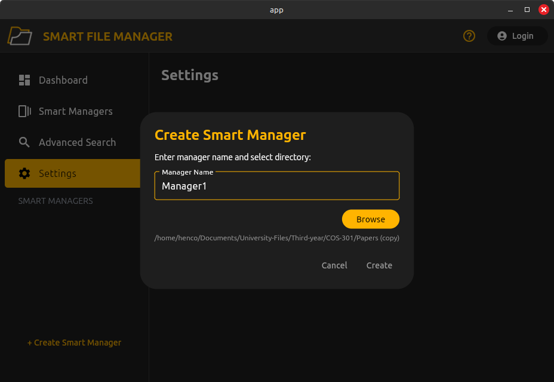

  

# User Manual  

**Version:** 1.0.0.0  
**Prepared By:** Spark Industries  
**Prepared For:** All our Users 

## Content
* [Introduction](#introduction)
* [Startup Page](#start-up-page)
* [Creating A Smart Manager](#creating-a-smart-manager)
* [Glossary](#glossary)

## Introduction
This document aims to server as a detailed manual of how to use smart file manager. It goes into detail on how to use the various features by simulating the flow of how the average user would likely interact with the system. It is broken up into sections corresponding to different features. If any term is unclear please consult the glossary linked [here](#glossary). We recommend reading this document sequentially for the best overview of how to use the system effectively.

**Note:** Please ensure that SFM has been installed on your system. Detailed instructions for doing so may be found [here](technical_installation.md)

## Start Up Page
When starting SFM for the first time you will be shown the following page

  

Currently there are no managers created so the dashboard page shows no statistics. From the sidebar we can see the various pages available to the user. These include:

1. Dashboard (currently selected)
2. Smart Managers 
3. Advanced Search
4. Settings

We'll now show each page as it appears without any smart managers created (note: dashboard already shown)

### Smart Manager

  

### Advanced Search 

  

### Settings 

  

## Creating a Smart Manager
To create a new smart manager to manage a subset of files follow these steps.

Click on the **+Create Smart Manager** button in the bottom-left corner of any page. The following pop-up will appear.

  

Enter the name of the manager and select the root of the new manager by using the **browse** button. Click **create** to confirm and make a new manager

  

After creating a manager the following screen will appear.

  

All of the your created managers will appear on the sidebar. Clicking on the manager in the sidebar will provide you with the page shown above. From here all files inside a manager may be viewed. The other features on this page will be explained in the sections to follow.

## Glossary
In this section we describe some terms that we use in the user manual.

### Smart Manager
A smart manager is the principle object of smart file manager. It can be thinked of as a repo which manages all files it has been set to track. When creating a smart manager you may select the root. All content contained in this root will be tracked by the smart manager and any operations that you wish to perform will act on the files inside this manager.

