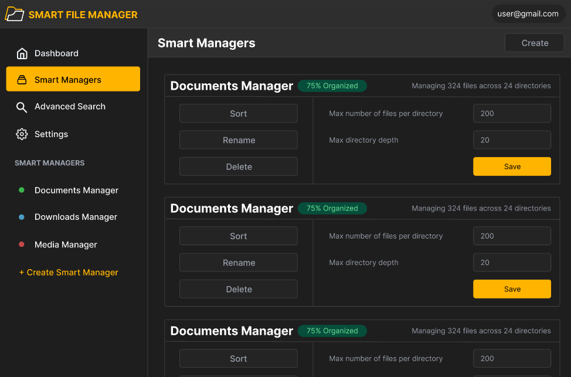
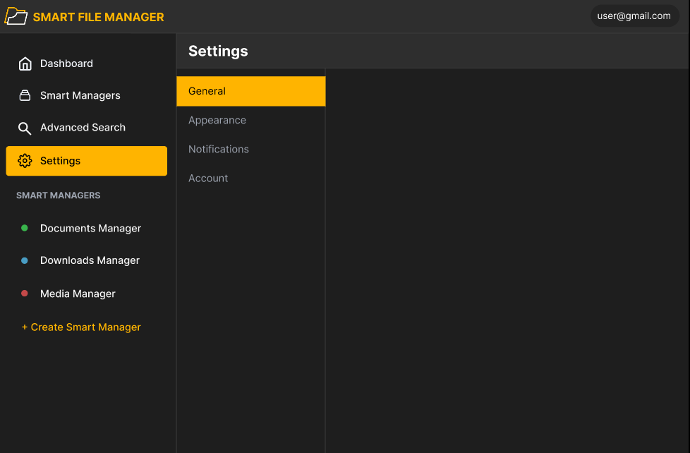
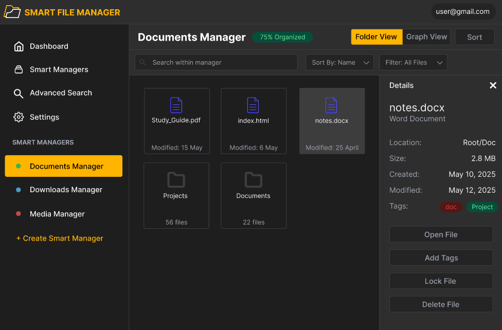

# Smart File Manager - Wireframe Documentation

## Overview

This document provides a wireframe description of the Smart File Manager (SFM) application's user interface, including all main screens and their components.

## Global Navigation

- **Main Navigation Menu:**
  - Dashboard - Home screen with metrics and quick access
  - Smart Managers - Configuration page Smart Managers
  - Advanced Search - Enhanced file search for entire system
  - Settings - Application settings and options
- **Smart Managers List:**
  - Lists all current Smart Managers
  - Option to add new Smart Manager

## 1. Dashboard

### Purpose

Main screen displaying system statistics and quick access to frequently used files.

### Elements

- **Statistics Cards:**

  - Total Files
  - Storage Used
  - Organization Level
  - Total Smart Managers

- **Quick Access Section:**
  - User can add files/folders that are often used.

## 2. Smart Managers

### Purpose

Interface for configuring and managing Smart Managers.

### Elements

- **Main Features:**

  - Create Smart Manager
  - Sort a Smart Manager
  - Delete a Smart Manager
  - Rename a Smart Manager

- **Configure Smart Manager**
  - Max files per directory
  - Max directory depth

## 3. Advanced Search

### Purpose

Comprehensive search interface for finding files using multiple criteria across all Smart Managers.

### Elements

- **Filter Options:**

  - File Type
  - Location
  - Date Modified
  - Size
  - Tags
  - Author/Owner

## 4. Settings

### Purpose

Configuration interface for application preferences and user settings.

### Elements

- **Settings Categories**
  - General
  - Appearance
  - Notifications
  - Account

## 5. Documents Manager - Folder View

### Purpose

Traditional folder-based interface for viewing and managing files within a Smart Sanager.

### Elements

- **Attributes Shown**

  - Title
  - Organization status
  - Meta Data
  - Tags

- **Search and Filter:**

  - Search(within manager)
  - Sort By
  - Filter

- **File Actions**
  - Open File
  - Add Tags
  - Lock File
  - Delete File

## 6. Documents Manager - Graph View

### Purpose

Visualization interface showing file relationships in a Graph format.

### Elements

- **Functionality:**

  - Same as Folder View but with Graph View selected

- **Visualization:**
  - Node graph showing file relationships
  - Central node representing primary folder
  - Connected nodes representing related files/folders
  - File details panel (same as in Folder View)
