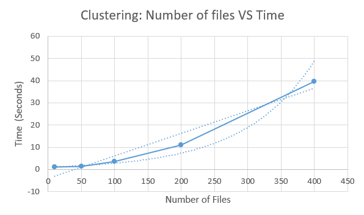

<p align="center">
  
</p>

# Non Function Testing Document

**Version:** 1.0.0.0  
**Prepared By:** Spark Industries  
**Prepared For:** Demo4 Purposes 

## Content
* [Introduction](#introduction)
* [Performance Test](#performance-testing)
* [Reliability Test](#reliability-test)

## Introduction 
The following document outlines some of the non functional testing we performed to ensure the quality requirements as outlined in our documentation.
It is broken up into specific non functional tests that we performed. It details why these tests were needed, what quality requirement it aims to test, how the tests were performed and the test results.

## Performance Testing

To ensure the adequate performance of our application we test 2 features specifically namely our clustering (semantic sorting) and keyword (used for smart search) endpoints. Both of the mentioned endpoints were tested due to them being the most performance intensive.

### Expected Results
We aim to ensure that both of these endpoints scales at least linearly in execution time for an increasing number of files. We cannot place a numerical value on exactly how long these tests should take, as it is heavily dependant on the hardware of the user using the service. We note the hardware of the machine used to run these tests in our experimental procedure.

### Experimental Procedure

To properly test these endpoints we conduct an experiment running both the clustering and keyword service for an increasing number of files. We make use of the same file types containing the same content (in this test a textfile). Note that different file types could slightly influence the results. To ensure accurate results we also run each test 3 times and take the average of the results to report on.  

To run these tests make use of the following command:  
```
make python_non_functional
```   

These tests were executed on a machine with the following hardware:  
* CPU: AMD Ryzen 5 5600H 3.30GHz
* RAM: 16GB 3200 MT/s
* DISK: Samsung SSD 980 500GB
Note that Disk speed in particular is important as the results are endpoints are bottlenecked by the I/O subsystem, owing to the files needing to be opened to extract metadata and keywords.

### Results
#### Clustering

Plotting the results obtained from our test yields the following results



As can be seen the clustering endpoint scales linearly in time with the number of files.

### Keywords

Plotting the results obtained from our test yields the following results


As can be seen the keyword endpoint scales linearly in time with the number of files.

## Reliability Test

### Expected Results
To ensure the reliability of our application we test that file integrity is preserved by our file operations. When performing a sorting operation (which will both traverse the directory and extract keywords) we must ensure that no file changes, or is somehow modified during the operation.

### Experimental Procedure

We conduct an experiment where we calculate the hashes for a subset of files. We then perform a sorting operation (which also extracts keywords) and afterwards we recalculate the file hashes. We compare these results to ensure that no file is modified by the operation.

### Results


To run this test make use of the following command:  
```
make python_non_functional
```   

Having run this test we can see from the output that no file's integrity has been compromised by any of the operations as the file's SHA256 hash remained unchanged.

