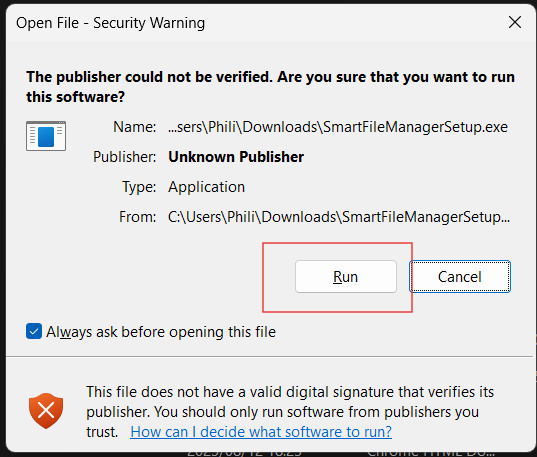
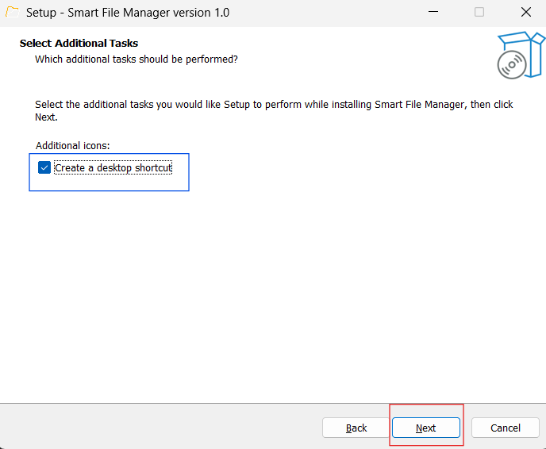
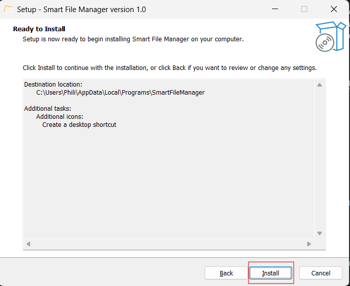
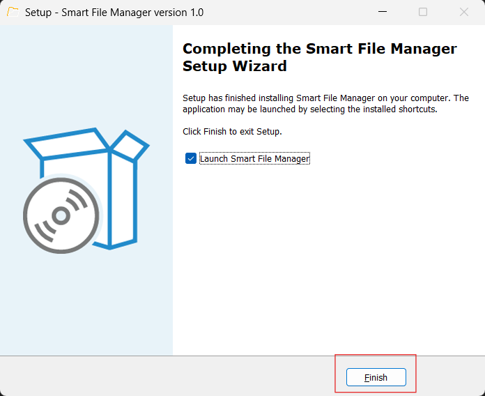

<p align="center">
  
</p>

# Technical Installation Document for SparkIndustries

**Version:** 1.0.0.0  
**Prepared By:** Spark Industries  
**Prepared For:** Southern Cross Solutions and Users of SFM 

## Content
* [Introduction](#introduction)
* [Installer](#installer)
* [Building from Scratch](#building-the-project-from-scratch)
* [Creating your own installer](#creating-your-own-installer)

## Introduction
The following document serves as the technical installation document for SparkIndustries. It provides detailed instructions for how to download and install the program using the following approaches:
1. Using the provided downloadable installer (The recommend approach)
2. Building the project from scratch via cloning the repository.
3. Creating your own installer (Not recommended but provided for completeness)

**A Note of supported platforms:**
Our application is designed with the intention to be useable on Microsoft Windows, Linux and MacOS. For the purpose of this demo we only provide an installer for Windows, however in the future we will be releasing an installer for Linux distibutions as well (Tested on Linux Mint). The requirement of an apple developer's lisence prevents us from deploying to MacOS. However Mac Users may still build the project from scratch using the instructions provided in this document. 

## Installer

This section details where to download the installer and how to use it to install Smart File Manager to your device. Please note that the Windows operating system might (and likely will) flag the application as high risk and administrator privileges may be required to allow the install. While SparkIndustries is not aware of any risk that the application might pose, we do not take any liability for issues or harm caused to a system by installing the program. User discresion is advised.

### Step 1: Downloading the installer
The installer may be downloaded from our google drive [here](https://drive.google.com/drive/folders/1KlQ3yYhmHYFbv0vVpLBJv5CjVyD5idO4) (approximately 500MB)

### Step 2: Running the installer
Execute the installer by double clicking on it. At this point you might be flagged by the security system as follows. Click the __run__ button as indicated to proceed.




Next you will be prompted to select the install destination. Choose this path as desired or use the default install location __Users/AppData/Local/Programs/SmartFileManager__ and click on __next__ to proceed.


You will now be prompted with a screen prompting you with additional tasks. On this page you may choose to create a desktop shortcut using the provided checkbox (higlighted in blue). After selecting your choice proceed by clicking on __next__.



Finally, confirm the installation by clicking on the __install__ button as highlighted.



The app will now install. After installation you will be shown the following screen from where you may choose to launch the app. Click on __finish__ to complete the process.


You have now successfully installed Smart File Manager!


## Building the project from scratch

This section details how the project can be built and run from scratch by cloning the repo and running all the various services required for the application to function. While we primarily suggest use of an installer this might be useful should you wish to run the application on a non supported operating system.

### Required Installs

The following must be installed on the local system before using this installation.

**Programming Languages:**
* Python 3 ([installation instructions here](https://www.python.org/downloads/))
* Golang ([installation instructions here](https://go.dev/doc/install))
* Flutter & Dart ([installation instructions here](https://docs.flutter.dev/install))

**Python Packages:**
* pytest 
* python-magic 
* mutagen 
* pypdf 
* python-docx 
* Pillow 
* pymediainfo 
* yake 
* scikit-learn 
* sentence-transformers 
* grpcio 
* grpcio-tools

Note: Using pip you may install all these as follows:

```bash
pip install \
  pytest \
  python-magic \
  mutagen \
  pypdf \
  python-docx \
  Pillow \
  pymediainfo \
  yake \
  scikit-learn \
  sentence-transformers \
  grpcio \
  grpcio-tools
```

**gRPC:**

gRPC must be installed for both go and python. Note the python install is included in the section above. Documentation for installing gRPC may be found [here](https://grpc.io/blog/installation/)

### Building the project

**Cloning the Repository**
Clone the repository onto your local device using the following command
```bash
git clone https://github.com/COS301-SE-2025/Smart-File-Manager
```

**Generating the gRPC protos:**
Having cloned the repository we must now generate the gRPC proto files required for running the project. Ensure you are in the root directory then run the following command
```bash
make proto_gen
make go_proto_gen
```

**Compling and running the go server:**
Next the go server must be compiled and started. From the root directory run the following command
```bash
make go_api
```

**Compiling and running the python server:**
Run the python server by running the following command from the root directory
```bash
make python_server
```
Ensure that you wait for the terminal to output __python server started__ before proceeding to the next step.

**Running the flutter app:**
Now that both the python and go server are running we can compile and run the actual flutter application using the following command from root:
```
flutter build
cd build 
flutter run
```  

The application should now be running and working as intended.

## Creating your own installer

This section details how to create your own installer, or rather the process we use to create our installer. 

**Note:** We do NOT recommend this approach to installing our program whatsoever! It has merely been added for completeness sake. 

The install instructions is what we used for creating our Windows installer and may or may not work for other operating systems. Should some user wish to create a different installer for this application we hope that this information may provide some reference point for how this process should be approached.

The document detailing this process may be found [here](installer_guide.md)