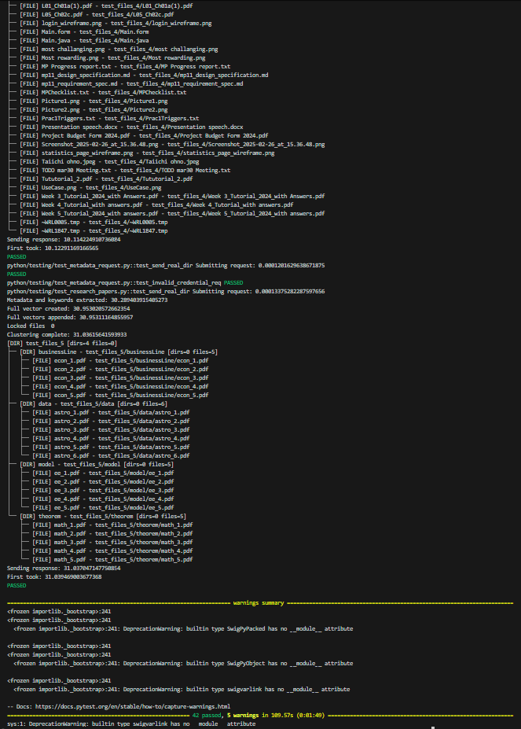
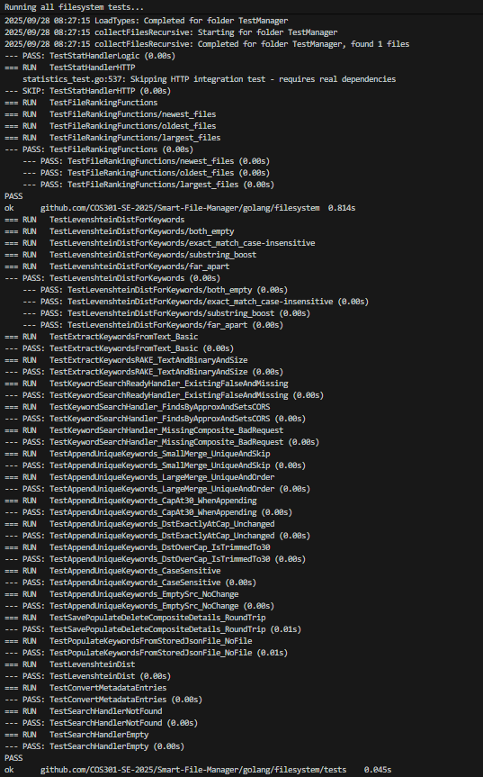
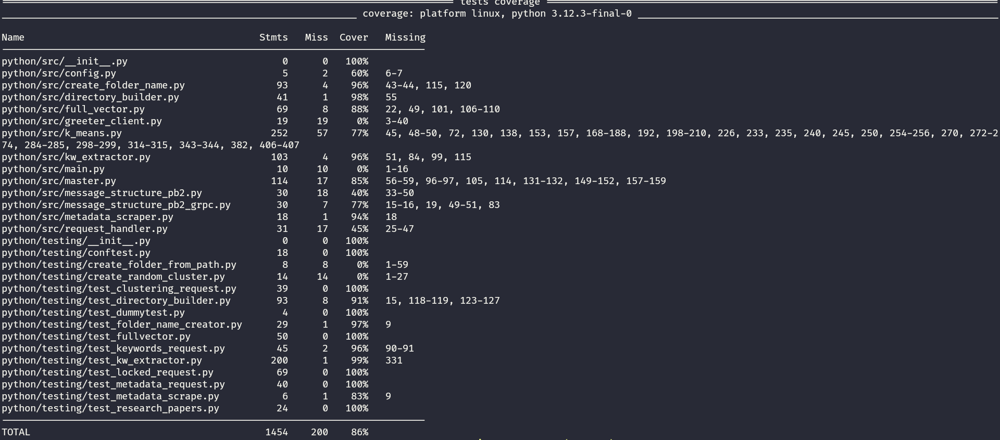
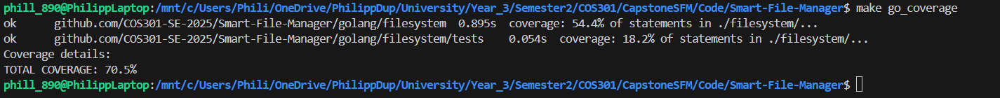

# Testing Policy Document

<p align="center">
  
</p>

**Version:** 1.0.0.0  
**Prepared By:** Spark Industries  
**Prepared For:** Southern Cross Solutions  
**Document Type:** Testing Policy Document  
**Demo:** Demo 4

## Content
* [Introduction](#introduction)
* [Policy Overview](#policy-overview)
* [Finding and Running the Tests](#finding-and-running-tests)
* [Test Execution](#testing-coverage)
* [Testing Coverage](#testing-coverage)


## Introduction
The following docment serves to outline our team's testing policy used to ensure the highest possible quality and reliability for our project.  

## Policy Overview
We believe that extensive testing is foundational for producing a high quality application with as little bugs as possible. To achieve this we make use of various levels of testing ensuring optimal functionality at every part of our project. These levels of testing are as follows:  

* Unit Testing: Testing the smallest isolatable parts of software. This also involves mocking any dependancies that such a unit might have.
* Integration Testing: Testing if various components interact correctly and expectedly.
* End To End (E2E) Testing: Tests if the entire workflows for a specific feature works from start to finish.
* Non Functional Testing: Ensure that the quality requirements are satisfied by our implementation - see [here](non_functional_tests.md)

## Finding and Running Tests
The location of the testing files may be found in the following locations from the project root

### Python Tests
#### Normal Tests

**location:** _python/testing_

They may be ran using

```
make python_test
```

#### Non Functional Tests

**location:** _python/non_functional_tests_

They may be ran using
```
make python_non_functional 
```

### Go Tests
**location:**  _golang/filesystem_  
Note that the tests are all .go files ending in _test

They may be ran using
```
make go_test
```

### Flutter Test
**location:** _app/test_

They may be ran using
```
cd app
flutter test --reporter=expanded
```

## Testing Execution
Proof that all tests executed are provided in the following screenshots for convenience, should you not wish to run them.

### Python


### Go



## Testing Coverage
The testing coverage for the various codebases are as follows

### Python



Total Coverage: 86%


### Go


Total Coverage: 70.5%