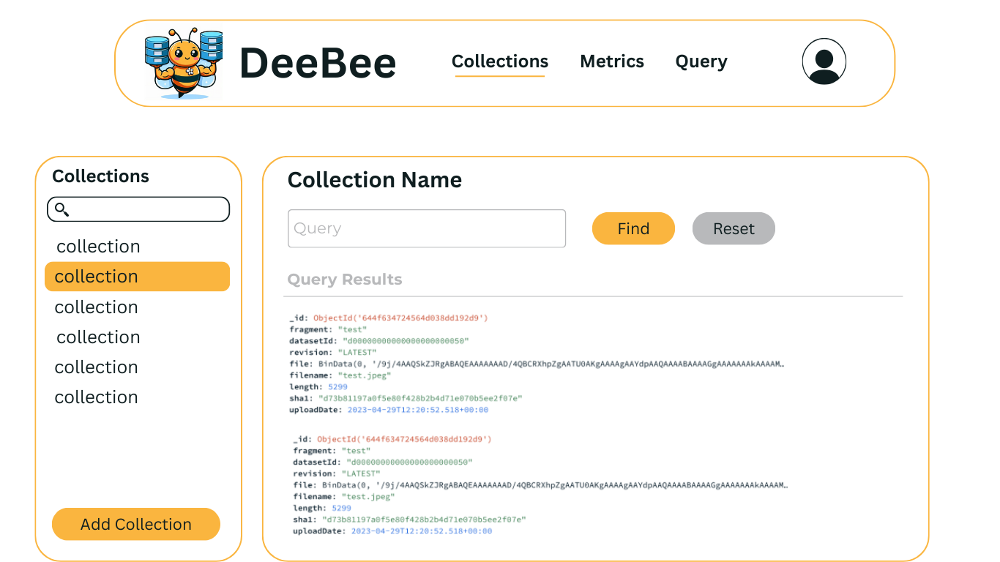
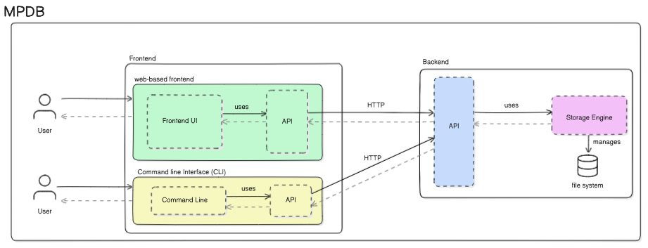

# COS301 MP11 Design Specification

The following document as the design specification for DeeBee

## Content
* [Wireframes](#wireframes-of-pages-being-to-be-implemented)
* [Architectural Diagram](#architectural-diagram) 

## Wireframes of pages being to be implemented
#### View and query collections page

#### View statistics page

#### Login page

## Screenshot of pages currently implemented
#### Login page

#### registration page

## Architectural Diagram

