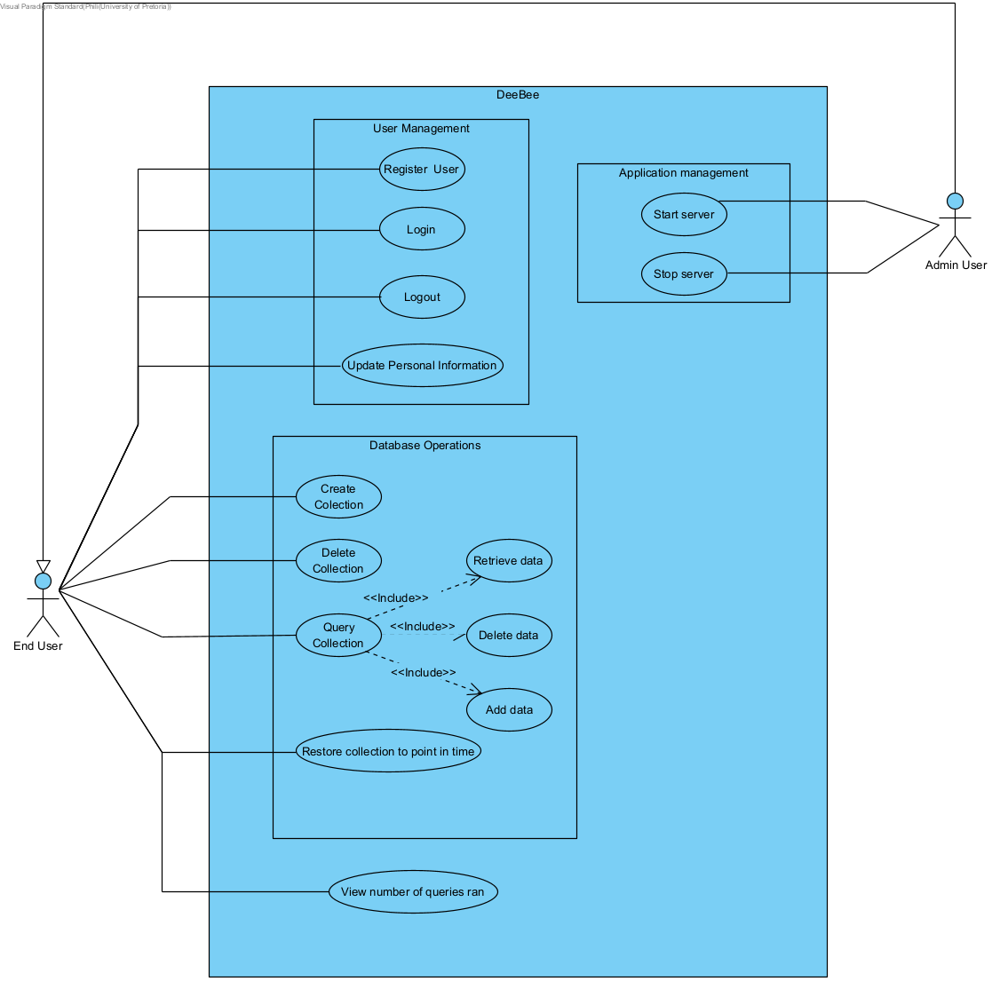

# COS301 MP 11 Requirement Spesification

## Background
Databases are an integral part of nearly every modern piece of production software out there. Data plays a critical role in the modern age. It has, in some sense, become a valueable currency and asset for those with the knowledge to investigate it.  

MPDB is a NoSQL database, which allows users to store and query data in a flexible manner not so easily acomplished by more traditional databases. The aim is to design a robust and elegant solution to managing the vast quantities of data encountered by companies and individuals in the digital age.

## Content
* [Functional Requirements](#functional-requirements)
* [Non Functional Requirement](#non-functional-requirement)
* [Use Case Diagram](#use-case-diagram)

## Functional Requirements
**FR1 Data Storage**   
* R1.1  Semi Structured data must be stored in a JSON format 
* R1.2  Data must be seperated by the user to which it belongs 
* R1.3  Data must be organised into collections which contains the JSON files 

**FR2 Data Insertion / Retrieval** 
* R2.1. Users must be able to query data 
* R2.2. Users must be able to get certain json objects from a certain collection 
* R2.3. Users must be able to return data matching a certain logical criteria or regular expression 
* R2.4. Users must be able to sort returned data 
* R2.5. Users must be able to specifiy the amount of data returned to them 
* R2.6. Users must be able add new data to the database 
* R2.7. Users must be able to delete data from the database 

**FR3 Users must be able to view database statistics such as how many queries have been ran**  

**FR4 Users must be able to rollback the system state to a previous point in time**  

## Non Functional Requirement
**NFR1 Query efficiency** 
* NF1.1 Store the 30 most recently used JSON objects in cache 
* NF1.2 Utilize column-based storage approach for flexible indexing and querying 

**NFR2 Security** 
* NF2.1 Use JWT authentication to ensure user's data privacy 
* NF2.2 Proxy requests from user to engine 

**NFR3 Validation** 
* NF3.1 JSON objects' syntax validated before storage 

**NFR4 Interfaces** 
* NF4.1 User must be able to interact with system via CLI / Terminal Client 
* NF4.2 User must be able to interact with system via a webapp 
* NF4.3 User must be able to interact with system through a REST API 
* NF4.4 A javascript client library must be provided to allow ease of use for developing systems using MPDB  

## Use Cases
<table border="1">
    <thead>
        <tr>
            <th>Use Case</th>
            <td>UC1 Register</td>
            <td>Abstract: Create an account for a user with a given email</td>
        </tr>
    </thead>
    <tbody>
        <tr>
            <th>Preconditions</th>
            <td colspan="2">
                <ul>
                    <li>No existing user for email</li>
                </ul>
            </td>
        </tr>
        <tr>
            <th>Postconditions</th>
            <td colspan="2">
                <ul>
                    <li>Account exist for user with given email</li>
                </ul>
            </td>
        </tr>
        <tr>
            <th>Invariants</th>
            <td colspan="2">
                <ul>
                </ul>
            </td>
        </tr>
    </tbody>
    <thead>
        <tr>
            <th>Use Case</th>
            <td>UC2 Login</td>
            <td>Abstract: User logs in using an email and password</td>
        </tr>
    </thead>
    <tbody>
        <tr>
            <th>Preconditions</th>
            <td colspan="2">
                <ul>
                    <li>User is registered</li>
                </ul>
            </td>
        </tr>
        <tr>
            <th>Postconditions</th>
            <td colspan="2">
                <ul>
                    <li>Users acquires JWT token for future API calls</li>
                </ul>
            </td>
        </tr>
        <tr>
            <th>Invariants</th>
            <td colspan="2">
                <ul>
                </ul>
            </td>
        </tr>
    </tbody>
    <thead>
        <tr>
            <th>Use Case</th>
            <td>UC3 Logout</td>
            <td>Abstract :Deletes users JWT token and signs them out</td>
        </tr>
    </thead>
    <tbody>
        <tr>
            <th>Preconditions</th>
            <td colspan="2">
                <ul>
                    <li>User is registered</li>
                    <li>User is logged in</li>
                </ul>
            </td>
        </tr>
        <tr>
            <th>Postconditions</th>
            <td colspan="2">
                <ul>
                    <li>No users session information stored</li>
                </ul>
            </td>
        </tr>
        <tr>
            <th>Invariants</th>
            <td colspan="2">
                <ul>
                    <li>User account details preserved</li>
                </ul>
            </td>
        </tr>
    <tbody>
    <thead>
        <tr>
            <th>Use Case</th>
            <td>UC4 Update Personal Information</td>
            <td>Abstract: Change user's associated account information</td>
        </tr>
    </thead>
    <tbody>
        <tr>
            <th>Preconditions</th>
            <td colspan="2">
                <ul>
                    <li>User is registered</li>
                    <li>User is logged in</li>
                </ul>
            </td>
        </tr>
        <tr>
            <th>Postconditions</th>
            <td colspan="2">
                <ul>
                    <li>User account details updated</li>
                </ul>
            </td>
        </tr>
        <tr>
            <th>Invariants</th>
            <td colspan="2">
                <ul>
                    <li>Associated account email address stays consistent</li>
                </ul>
            </td>
        </tr>
    <tbody>
    <thead>
        <tr>
            <th>Use Case</th>
            <td>UC5 Create collection</td>
            <td>Abstract: Creates a new collection to store JSON object</td>
        </tr>
    </thead>
    <tbody>
        <tr>
            <th>Preconditions</th>
            <td colspan="2">
                <ul>
                    <li>User is registered</li>
                    <li>User is logged in</li>
                </ul>
            </td>
        </tr>
        <tr>
            <th>Postconditions</th>
            <td colspan="2">
                <ul>
                    <li>A new empty collection is created</li>
                </ul>
            </td>
        </tr>
        <tr>
            <th>Invariants</th>
            <td colspan="2">
                <ul>
                    <li>All previous collections stay unchanged</li>
                </ul>
            </td>
        </tr>
    <tbody>
    <thead>
        <tr>
            <th>Use Case</th>
            <td>UC6 Delete Collection</td>
            <td>Abstract: Removes a collection and all stored data permenantly</td>
        </tr>
    </thead>
    <tbody>
        <tr>
            <th>Preconditions</th>
            <td colspan="2">
                <ul>
                    <li>User is registered</li>
                    <li>User is logged in</li>
                    <li>Deleted collection exists</li>
                </ul>
            </td>
        </tr>
        <tr>
            <th>Postconditions</th>
            <td colspan="2">
                <ul>
                    <li>All data associated with previous collection is removed</li>
                </ul>
            </td>
        </tr>
        <tr>
            <th>Invariants</th>
            <td colspan="2">
                <ul>
                    <li>All other collections stay unchanged</li>
                </ul>
            </td>
        </tr>
    <tbody>
    <thead>
        <tr>
            <th>Use Case</th>
            <td>UC7.1 Query Collection -> Retrieve Data</td>
            <td>Abstract: Retrieve data from a given collection matching the query criteria</td>
        </tr>
    </thead>
    <tbody>
        <tr>
            <th>Preconditions</th>
            <td colspan="2">
                <ul>
                    <li>User is registered</li>
                    <li>User is logged in</li>
                    <li>Query collection exists</li>
                </ul>
            </td>
        </tr>
        <tr>
            <th>Postconditions</th>
            <td colspan="2">
                <ul>
                </ul>
            </td>
        </tr>
        <tr>
            <th>Invariants</th>
            <td colspan="2">
                <ul>
                    <li>Queried data is not modified in any way</li>
                </ul>
            </td>
        </tr>
    <tbody>
    <thead>
        <tr>
            <th>Use Case</th>
            <td>UC7.2 Query Collection -> Delete data</td>
            <td>Abstract: Deletes data from a given collection matching query criteria<td>
        </tr>
    </thead>
    <tbody>
        <tr>
            <th>Preconditions</th>
            <td colspan="2">
                <ul>
                    <li>User is registered</li>
                    <li>User is logged in</li>
                    <li>Query collection exists</li>
                </ul>
            </td>
        </tr>
        <tr>
            <th>Postconditions</th>
            <td colspan="2">
                <ul>
                    <li>Data matching query is logically removed</li>
                </ul>
            </td>
        </tr>
        <tr>
            <th>Invariants</th>
            <td colspan="2">
                <ul>
                    <li>No JSON not matching the query criteria is logically removed</li>
                </ul>
            </td>
        </tr>
    <tbody>
    <thead>
        <tr>
            <th>Use Case</th>
            <td>UC7.3 Query Collection -> Add data</td>
            <td>Abstract: Adds an additional JSON object to the current collection</td>
        </tr>
    </thead>
    <tbody>
        <tr>
            <th>Preconditions</th>
            <td colspan="2">
                <ul>
                    <li>User is registered</li>
                    <li>User is logged in</li>
                    <li>Query collection exist</li>
                </ul>
            </td>
        </tr>
        <tr>
            <th>Postconditions</th>
            <td colspan="2">
                <ul>
                    <li>Created key.json file for all JSON objects key that did not previously exist and added data to it</li>
                    <li>Added entire json object with system generated id to main.json</li>
                </ul>
            </td>
        </tr>
        <tr>
            <th>Invariants</th>
            <td colspan="2">
                <ul>
                    <li>No existing data deleted or updated</li>
                </ul>
            </td>
        </tr>
    <tbody>
    <thead>
        <tr>
            <th>Use Case</th>
            <td>UC8 Restore system to point in time</td>
            <td>Abstract: Undo / Redo queries to return system to state it had at given timestamp</td>
        </tr>
    </thead>
    <tbody>
        <tr>
            <th>Preconditions</th>
            <td colspan="2">
                <ul>
                    <li>User is registered</li>
                    <li>User is logged in</li>
                    <li>System state existed at given timestamp</li>
                </ul>
            </td>
        </tr>
        <tr>
            <th>Postconditions</th>
            <td colspan="2">
                <ul>
                    <li>System is in exact state as it was during given timestamp</li>
                </ul>
            </td>
        </tr>
        <tr>
            <th>Invariants</th>
            <td colspan="2">
                <ul>
                    <li>No other collection state is modified</li>
                </ul>
            </td>
        </tr>
    <tbody>
    <thead>
        <tr>
            <th>Use Case</th>
            <td>UC9 Start Server</td>
            <td>Abstract: Start both the C++ engine server and NodeJS webapplication server</td>
        </tr>
    </thead>
    <tbody>
        <tr>
            <th>Preconditions</th>
            <td colspan="2">
                <ul>
                    <li>C++ server is turned off</li>
                    <li>NodeJS server is turned off</li>
                </ul>
            </td>
        </tr>
        <tr>
            <th>Postconditions</th>
            <td colspan="2">
                <ul>
                    <li>C++ server is running and listening to requests on designated port</li>
                    <li>NodeJS server is running and serving clients the web application</li>
                </ul>
            </td>
        </tr>
        <tr>
            <th>Invariants</th>
            <td colspan="2">
                <ul>
                </ul>
            </td>
        </tr>
    <tbody>
    <thead>
        <tr>
            <th>Use Case</th>
            <td>UC10 Stop Server</td>
            <td>Abstract: Stop both the C++ engine server and NodeJS webapplication server</td>
        </tr>
    </thead>
    <tbody>
        <tr>
            <th>Preconditions</th>
            <td colspan="2">
                <ul>
                    <li>C++ server is running</li>
                    <li>NodeJS server is running</li>
                </ul>
            </td>
        </tr>
        <tr>
            <th>Postconditions</th>
            <td colspan="2">
                <ul>
                    <li>C++ server is stopped</li>
                    <li>All outstanding request are processed</li>
                    <li>User sessions safely terminated</li>
                    <li>All changes made to objects in memory is flushed to disk</li>
                </ul>
            </td>
        </tr>
        <tr>
            <th>Invariants</th>
            <td colspan="2">
                <ul>
                </ul>
            </td>
        </tr>
    <tbody>
</table>

## Use Case Diagram

